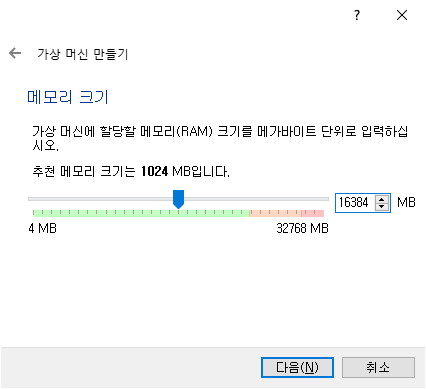
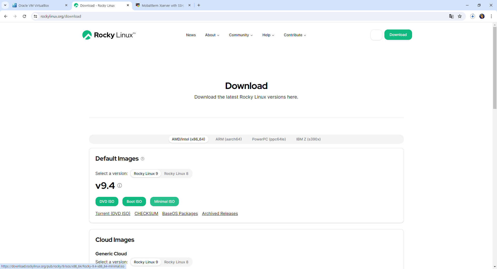

# 1. 가상 시스템 실습 환경 구축

## 1-1. Virtual Box 다운로드 및 설치

### 1-1-1. Virtual Box 다운로드


[Virtual Box 다운로드 바로가기](https://www.virtualbox.org/wiki/Download_Old_Builds_6_1)

<br><br>

### 1-1-2. Virtual Box 설치


<br><br>

### 1-1-3. Virtual Box 설정

#### 1-1-3-1. Rocky Linux 설치 전 설정





<br>

#### 1-1-3-2. Rocky Linux 다운로드




[Rocky Linux 다운로드 바로가기](https://rockylinux.org/download)

<br>

#### 1-1-3-3. Rocky Linux 이미지 지정 및 Vm 설정


<br>

#### 1-1-3-4. Rocky Linux 설치


<br>

#### 1-1-3-5. MobaXterm 연결을 위한 설정

- Virtual Box의 Rocky Linux를 기동한 후 root로 로그인 하고, 아래 명령을 실행합니다.

```sh
ip a
nmcli con mod enp0s8 \
ipv4.method manual \
ipv4.address 172.16.0.200/24
poweroff
```

<br>


- 헤드리스방식은 백그라운드 방식으로 화면에 나타나지 않고 계속 실행중이 될 수 있도록 합니다.

<br><br><br>


## 1-2. MobaXterm 다운로드 및 설치

### 1-2-1. MobaXterm 다운로드


[MobaXterm 다운로드 바로가기](https://mobaxterm.mobatek.net/download-home-edition.html)

<br><br>

### 1-2-2. MobaXterm 설치


<br><br>

### 1-2-3. MobaXterm 설정 및 실행


<br><br><br><br>

# 2. Docker

## 2-1. Docker 란?

### 2-1-1.Docker의 개념

- Docker는 애플리케이션의 개발, 배포, 확장을 단순화하고 효율적으로 관리할 수 있게 해줍니다.

<br>

#### 2-1-1-1. 컨테이너 (Container)

- 정의 : 컨테이너는 애플리케이션과 그 종속성을 포함한 패키지로, 독립적인 실행 환경을 제공합니다.
- 특징 : 호스트 시스템의 커널을 공유하지만, 다른 컨테이너와 격리된 공간에서 실행됩니다.

<br>

#### 2-1-1-2. 이미지 (Image)

- 정의: 컨테이너를 생성하기 위한 읽기 전용 템플릿입니다.
- 특징: 여러 계층(layer)으로 구성되며, 애플리케이션과 그 실행에 필요한 모든 파일과 설정을 포함합니다.

<br>

#### 2-1-1-3. Docker Daemon

- 정의: Docker 엔진의 핵심으로, 컨테이너와 이미지를 관리하는 백그라운드 프로세스입니다.
- 역할: Docker 클라이언트의 요청을 처리하고, 이미지 빌드, 컨테이너 실행, 네트워크 관리 등을 수행합니다.

<br>

#### 2-1-1-4. Docker 클라이언트 (Client)

정의: 사용자가 Docker Daemon과 상호작용할 수 있게 해주는 명령줄 도구입니다.
역할: Docker 명령을 입력하여 Docker Daemon에게 작업을 요청합니다.

<br>

#### 2-1-1-5. Docker Registry

- 정의: Docker 이미지를 저장하고 배포하는 중앙 저장소입니다.
- 특징: Docker Hub와 같은 공용 레지스트리와, 사설 레지스트리를 사용할 수 있습니다.

<br><br>

### 2-1-2. Docker의 역할

#### 2-1-2-1. 애플리케이션 격리

각 컨테이너는 독립적인 환경을 제공하여, 애플리케이션 간의 충돌을 방지합니다.
서로 다른 애플리케이션을 동일한 호스트에서 독립적으로 실행할 수 있습니다.

<br>

#### 2-1-2-2. 이식성 (Portability)

컨테이너는 운영체제에 독립적이어서, 한 환경에서 빌드된 이미지를 다른 환경에서도 동일하게 실행할 수 있습니다.
개발 환경, 테스트 환경, 프로덕션 환경 간의 일관성을 유지합니다.

<br>

#### 2-1-2-3. 효율성

컨테이너는 가상 머신보다 경량이며, 시스템 자원을 더 효율적으로 사용합니다.
빠른 시작과 중지를 지원합니다.

<br>

#### 2-1-2-4. 자동화

Dockerfile과 Docker Compose를 사용하여 애플리케이션의 빌드, 배포, 확장을 자동화할 수 있습니다.
CI/CD 파이프라인에 쉽게 통합할 수 있습니다.

<br><br>

### 2-1-3. Docker의 주요 기능

#### 2-1-3-1. 컨테이너 관리

생성, 시작, 중지, 삭제: 컨테이너의 생명 주기를 관리합니다.
컨테이너 실행: 독립적인 실행 환경에서 애플리케이션을 실행합니다.

<br>

#### 2-1-3-2. 이미지 관리

이미지 빌드: Dockerfile을 사용하여 이미지를 빌드합니다.
이미지 배포: 이미지를 레지스트리에 푸시(push)하고, 필요한 이미지를 풀(pull)하여 사용합니다.

<br>

#### 2-1-3-3. 네트워킹

컨테이너 간 네트워크: 컨테이너 간의 통신을 위해 가상 네트워크를 설정합니다.
포트 매핑: 호스트 시스템의 포트를 컨테이너에 매핑하여 외부에서 접근할 수 있게 합니다.

<br>

#### 2-1-3-4. 데이터 관리

볼륨: 컨테이너와 호스트 간의 데이터를 공유하고 영구 저장소를 제공합니다.
바인드 마운트: 호스트의 특정 디렉토리를 컨테이너에 마운트합니다.

<br>

#### 2-1-3-5. 오케스트레이션

Docker Swarm: 네이티브 클러스터링 및 컨테이너 오케스트레이션 도구로, 여러 호스트에 걸쳐 컨테이너를 관리합니다.
Kubernetes 통합: Kubernetes와의 통합을 통해 컨테이너 오케스트레이션 기능을 제공합니다.

<br>

#### 2-1-3-6. 자동화 도구

Docker Compose: 다중 컨테이너 애플리케이션을 정의하고 실행할 수 있는 도구입니다. docker-compose.yml 파일을 사용하여 서비스, 네트워크, 볼륨 등을 정의합니다.
Dockerfile: 이미지를 자동으로 빌드하기 위한 스크립트 파일입니다.

<br><br><br>

## 2-2. Docker 구성 요소

### 2-2-1. Docker Daemon (dockerd)

- 역할: Docker Daemon은 Docker 클라이언트의 요청을 처리하고 컨테이너의 생명 주기를 관리합니다. 이미지 빌드, 실행, 네트워킹 및 - 볼륨 관리를 포함한 모든 Docker 작업을 수행합니다.
- 동작 방식: 백그라운드에서 실행되며 클라이언트 명령을 수신 대기합니다.

<br><br>

### 2-2-2. Docker Client (docker)

- 역할: 사용자가 Docker를 조작할 수 있는 명령줄 도구입니다.
- 동작 방식: 사용자가 입력한 명령을 Docker Daemon에 전달하여 작업을 수행합니다.

<br><br>

### 2-2-3. Docker Image

역할: 컨테이너를 생성하기 위한 읽기 전용 템플릿입니다.
구성: 애플리케이션과 그 애플리케이션이 실행되기 위해 필요한 모든 파일과 메타데이터를 포함합니다.
동작 방식: Dockerfile을 사용하여 이미지를 빌드하고, 레지스트리에서 이미지를 가져와 사용할 수 있습니다.

<br><br>

### 2-2-4. Docker Container

역할: 이미지로부터 생성된 실행 가능한 인스턴스입니다.
동작 방식: 격리된 환경에서 애플리케이션을 실행합니다. 컨테이너는 이미지의 불변성을 유지하며 독립적으로 실행됩니다.

<br><br>

### 2-2-5. Docker Registry (Docker Hub)

역할: Docker 이미지를 저장하고 배포하는 중앙 저장소입니다.
구성: 공용 레지스트리 (예: Docker Hub)와 사설 레지스트리를 사용할 수 있습니다.
동작 방식: 이미지를 푸시(push)하여 저장하고, 풀(pull)하여 가져와 사용할 수 있습니다.

<br><br>

### 2-2-6. Dockerfile

역할: Docker 이미지를 빌드하기 위한 스크립트 파일입니다.
구성: 각 단계에서 실행할 명령을 정의하며, 텍스트 파일 형식으로 작성됩니다.
동작 방식: Dockerfile을 기반으로 Docker 이미지가 생성됩니다.

<br><br>

### 2-2-7. Docker Compose

역할: 다중 컨테이너 애플리케이션을 정의하고 실행하기 위한 도구입니다.
구성: docker-compose.yml 파일을 사용하여 서비스, 네트워크, 볼륨 등을 정의합니다.
동작 방식: docker-compose up 명령으로 모든 서비스를 일괄 실행합니다.

<br><br>

### 2-2-8. Docker Network

역할: 컨테이너 간 통신을 설정하는 가상 네트워크입니다.
구성: 브리지 네트워크, 호스트 네트워크, 오버레이 네트워크 등 다양한 네트워크 모드가 있습니다.
동작 방식: 컨테이너가 서로 통신할 수 있도록 네트워크를 설정하고 관리합니다.

<br><br>

### 2-2-9. Docker Volume

역할: 컨테이너와 호스트 시스템 간 데이터 공유를 위한 영구 스토리지입니다.
구성: 컨테이너가 종료되거나 삭제되어도 데이터를 유지합니다.
동작 방식: 볼륨을 마운트하여 데이터 공유 및 보존을 관리합니다.

<br><br>

### 2-2-10. Docker Swarm

역할: Docker의 네이티브 클러스터링 및 오케스트레이션 도구입니다.
구성: 여러 Docker 엔진을 하나의 클러스터로 묶어 관리합니다.
동작 방식: 서비스 배포, 스케일링, 로드 밸런싱을 포함한 클러스터 관리 기능을 제공합니다.

<br><br><br>


## 2-3. Dockerfile 작성 문법

Dockerfile은 여러 가지 명령어를 사용하여 작성됩니다. 주요 명령어는 다음과 같습니다:

- FROM: 베이스 이미지를 지정합니다.
- RUN: 컨테이너 내에서 명령을 실행합니다.
- COPY 또는 ADD: 파일을 이미지에 복사합니다.
- WORKDIR: 작업 디렉토리를 설정합니다.
- CMD 또는 ENTRYPOINT: 컨테이너가 시작될 때 실행할 명령을 지정합니다.
- EXPOSE: 컨테이너에서 사용할 포트를 지정합니다.
- ENV: 환경 변수를 설정합니다.

예시: Nginx와 커스텀 HTML 파일을 포함한 Dockerfile

아래는 Nginx와 커스텀 HTML 파일을 포함한 이미지를 생성하기 위한 Dockerfile 예시입니다:

### 2-3-1. 프로젝트 디렉토리 구조

```lua
project/
│
├── Dockerfile
└── html/
    └── index.html
```

<br>

### 2-3-2. index.html 파일 내용

```html
<!DOCTYPE html>
<html>
<head>
    <title>Welcome to Nginx!</title>
</head>
<body>
    <h1>Success! The Nginx server is working!</h1>
</body>
</html>
```

### 2-3-3. Dockerfile 작성

```dockerfile
# 베이스 이미지로 nginx를 사용
FROM nginx:latest

# 환경 변수를 설정 (옵션)
ENV NGINX_VERSION 1.19.3

# 호스트 시스템의 html 디렉토리 내용을 컨테이너의 /usr/share/nginx/html 디렉토리로 복사
COPY html/ /usr/share/nginx/html/

# Nginx 컨테이너가 80번 포트를 노출하도록 설정
EXPOSE 80

# Nginx를 실행하는 기본 명령 설정
CMD ["nginx", "-g", "daemon off;"]
```

<br>

### 2-3-4. Docker 이미지 빌드

프로젝트 디렉토리로 이동하여 다음 명령을 실행합니다:

```bash
docker build -t mynginx .
```

<br>

### 2-3-5. Docker 컨테이너 실행

```bash
docker run -d -p 80:80 mynginx
```

<br>

**Dockerfile 설명**

- FROM nginx:latest: 최신 버전의 Nginx 이미지를 베이스 이미지로 사용합니다.
- ENV NGINX_VERSION 1.19.3: 환경 변수를 설정합니다. 이 예제에서는 Nginx 버전을 설정했습니다.
- COPY html/ /usr/share/nginx/html/: 호스트 시스템의 html 디렉토리 내용을 컨테이너의 /usr/share/nginx/html/ 디렉토리에 복사합니다.
- EXPOSE 80: 컨테이너가 80번 포트를 노출하도록 설정합니다.
- CMD ["nginx", "-g", "daemon off;"]: Nginx를 포그라운드 모드로 실행하도록 설정합니다

