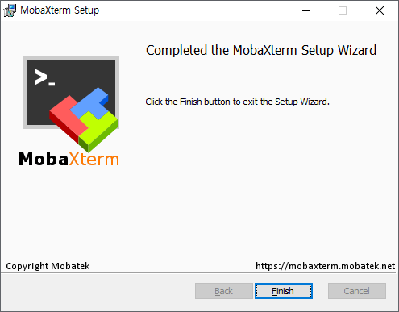
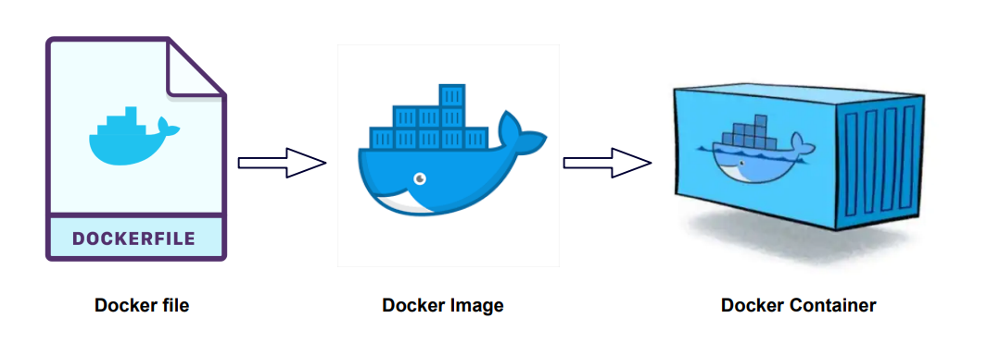
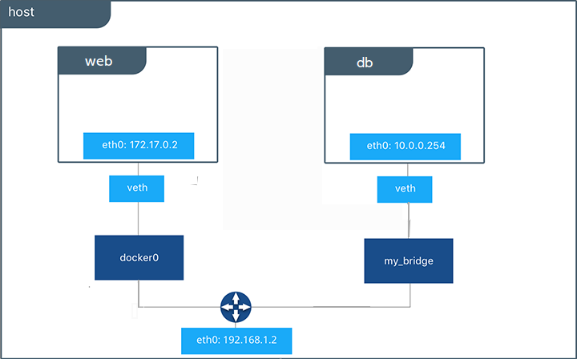
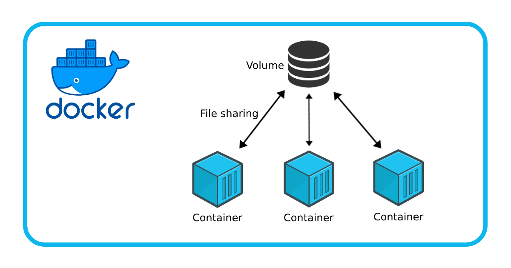

# 1. 가상 시스템 실습 환경 구축

## 1-1. Virtual Box 다운로드 및 설치

### 1-1-1. Virtual Box 다운로드


[Virtual Box 다운로드 바로가기](https://www.virtualbox.org/wiki/Download_Old_Builds_6_1)

<br><br>

### 1-1-2. Virtual Box 설치


<br><br>

### 1-1-3. Virtual Box 설정

#### 1-1-3-1. Rocky Linux 설치 전 설정


<br>

#### 1-1-3-2. Rocky Linux 다운로드


[Rocky Linux 다운로드 바로가기](https://rockylinux.org/download)

<br>

#### 1-1-3-3. Rocky Linux 이미지 지정 및 Vm 설정


<br>

#### 1-1-3-4. Rocky Linux 설치


<br>

#### 1-1-3-5. MobaXterm 연결을 위한 설정

- Virtual Box의 Rocky Linux를 기동한 후 root로 로그인 하고, 아래 명령을 실행합니다.

```sh
ip a
nmcli con mod enp0s8 \
ipv4.method manual \
ipv4.address 172.16.0.200/24
poweroff
```

<br>


- 헤드리스방식은 백그라운드 방식으로 화면에 나타나지 않고 계속 실행중이 될 수 있도록 합니다.

<br><br><br>


## 1-2. MobaXterm 다운로드 및 설치

### 1-2-1. MobaXterm 다운로드


[MobaXterm 다운로드 바로가기](https://mobaxterm.mobatek.net/download-home-edition.html)

<br><br>

### 1-2-2. MobaXterm 설치




<br><br>

### 1-2-3. MobaXterm 설정 및 실행


<br><br><br><br>

# 2. Docker

## 2-1. Docker 란?

### 2-1-1.Docker의 개념



- Docker는 애플리케이션의 개발, 배포, 확장을 단순화하고 효율적으로 관리할 수 있게 해줍니다.

<br>

#### 2-1-1-1. 컨테이너 (Container)

- 정의 : 컨테이너는 애플리케이션과 그 종속성을 포함한 패키지로, 독립적인 실행 환경을 제공합니다.
- 특징 : 호스트 시스템의 커널을 공유하지만, 다른 컨테이너와 격리된 공간에서 실행됩니다.


<br>

#### 2-1-1-2. 이미지 (Image)

- 정의: 컨테이너를 생성하기 위한 읽기 전용 템플릿입니다.
- 특징: 여러 계층(layer)으로 구성되며, 애플리케이션과 그 실행에 필요한 모든 파일과 설정을 포함합니다.


<br>

#### 2-1-1-3. Docker Daemon

- 정의: Docker 엔진의 핵심으로, 컨테이너와 이미지를 관리하는 백그라운드 프로세스입니다.
- 역할: Docker 클라이언트의 요청을 처리하고, 이미지 빌드, 컨테이너 실행, 네트워크 관리 등을 수행합니다.

<br>

#### 2-1-1-4. Docker 클라이언트 (Client)

정의: 사용자가 Docker Daemon과 상호작용할 수 있게 해주는 명령줄 도구입니다.
역할: Docker 명령을 입력하여 Docker Daemon에게 작업을 요청합니다.

<br>

#### 2-1-1-5. Docker Registry

- 정의: Docker 이미지를 저장하고 배포하는 중앙 저장소입니다.
- 특징: Docker Hub와 같은 공용 레지스트리와, 사설 레지스트리를 사용할 수 있습니다.

<br><br>

### 2-1-2. Docker의 역할

#### 2-1-2-1. 애플리케이션 격리

각 컨테이너는 독립적인 환경을 제공하여, 애플리케이션 간의 충돌을 방지합니다.
서로 다른 애플리케이션을 동일한 호스트에서 독립적으로 실행할 수 있습니다.

<br>

#### 2-1-2-2. 이식성 (Portability)

컨테이너는 운영체제에 독립적이어서, 한 환경에서 빌드된 이미지를 다른 환경에서도 동일하게 실행할 수 있습니다.
개발 환경, 테스트 환경, 프로덕션 환경 간의 일관성을 유지합니다.

<br>

#### 2-1-2-3. 효율성

컨테이너는 가상 머신보다 경량이며, 시스템 자원을 더 효율적으로 사용합니다.
빠른 시작과 중지를 지원합니다.

<br>

#### 2-1-2-4. 자동화

Dockerfile과 Docker Compose를 사용하여 애플리케이션의 빌드, 배포, 확장을 자동화할 수 있습니다.
CI/CD 파이프라인에 쉽게 통합할 수 있습니다.

<br><br>

### 2-1-3. Docker의 주요 기능

#### 2-1-3-1. 컨테이너 관리

생성, 시작, 중지, 삭제: 컨테이너의 생명 주기를 관리합니다.
컨테이너 실행: 독립적인 실행 환경에서 애플리케이션을 실행합니다.

<br>

#### 2-1-3-2. 이미지 관리

이미지 빌드: Dockerfile을 사용하여 이미지를 빌드합니다.
이미지 배포: 이미지를 레지스트리에 푸시(push)하고, 필요한 이미지를 풀(pull)하여 사용합니다.

<br>

#### 2-1-3-3. 네트워킹

컨테이너 간 네트워크: 컨테이너 간의 통신을 위해 가상 네트워크를 설정합니다.
포트 매핑: 호스트 시스템의 포트를 컨테이너에 매핑하여 외부에서 접근할 수 있게 합니다.

<br>

#### 2-1-3-4. 데이터 관리

볼륨: 컨테이너와 호스트 간의 데이터를 공유하고 영구 저장소를 제공합니다.
바인드 마운트: 호스트의 특정 디렉토리를 컨테이너에 마운트합니다.

<br>

#### 2-1-3-5. 오케스트레이션

Docker Swarm: 네이티브 클러스터링 및 컨테이너 오케스트레이션 도구로, 여러 호스트에 걸쳐 컨테이너를 관리합니다.
Kubernetes 통합: Kubernetes와의 통합을 통해 컨테이너 오케스트레이션 기능을 제공합니다.

<br>

#### 2-1-3-6. 자동화 도구

Docker Compose: 다중 컨테이너 애플리케이션을 정의하고 실행할 수 있는 도구입니다. docker-compose.yml 파일을 사용하여 서비스, 네트워크, 볼륨 등을 정의합니다.
Dockerfile: 이미지를 자동으로 빌드하기 위한 스크립트 파일입니다.

<br><br><br>

## 2-2. Docker 구성 요소

### 2-2-1. Docker Daemon (dockerd)

- 역할: Docker Daemon은 Docker 클라이언트의 요청을 처리하고 컨테이너의 생명 주기를 관리합니다. 이미지 빌드, 실행, 네트워킹 및 - 볼륨 관리를 포함한 모든 Docker 작업을 수행합니다.
- 동작 방식: 백그라운드에서 실행되며 클라이언트 명령을 수신 대기합니다.


<br><br>

### 2-2-2. Docker Client (docker)

- 역할: 사용자가 Docker를 조작할 수 있는 명령줄 도구입니다.
- 동작 방식: 사용자가 입력한 명령을 Docker Daemon에 전달하여 작업을 수행합니다.


<br><br>

### 2-2-3. Docker Image

역할: 컨테이너를 생성하기 위한 읽기 전용 템플릿입니다.
구성: 애플리케이션과 그 애플리케이션이 실행되기 위해 필요한 모든 파일과 메타데이터를 포함합니다.
동작 방식: Dockerfile을 사용하여 이미지를 빌드하고, 레지스트리에서 이미지를 가져와 사용할 수 있습니다.


<br><br>

### 2-2-4. Docker Container

역할: 이미지로부터 생성된 실행 가능한 인스턴스입니다.
동작 방식: 격리된 환경에서 애플리케이션을 실행합니다. 컨테이너는 이미지의 불변성을 유지하며 독립적으로 실행됩니다.


<br><br>

### 2-2-5. Docker Registry (Docker Hub)

역할: Docker 이미지를 저장하고 배포하는 중앙 저장소입니다.
구성: 공용 레지스트리 (예: Docker Hub)와 사설 레지스트리를 사용할 수 있습니다.
동작 방식: 이미지를 푸시(push)하여 저장하고, 풀(pull)하여 가져와 사용할 수 있습니다.


<br><br>

### 2-2-6. Dockerfile

역할: Docker 이미지를 빌드하기 위한 스크립트 파일입니다.
구성: 각 단계에서 실행할 명령을 정의하며, 텍스트 파일 형식으로 작성됩니다.
동작 방식: Dockerfile을 기반으로 Docker 이미지가 생성됩니다.


<br><br>

### 2-2-7. Docker Compose

역할: 다중 컨테이너 애플리케이션을 정의하고 실행하기 위한 도구입니다.
구성: docker-compose.yml 파일을 사용하여 서비스, 네트워크, 볼륨 등을 정의합니다.
동작 방식: docker-compose up 명령으로 모든 서비스를 일괄 실행합니다.


<br><br>

### 2-2-8. Docker Network

역할: 컨테이너 간 통신을 설정하는 가상 네트워크입니다.
구성: 브리지 네트워크, 호스트 네트워크, 오버레이 네트워크 등 다양한 네트워크 모드가 있습니다.
동작 방식: 컨테이너가 서로 통신할 수 있도록 네트워크를 설정하고 관리합니다.



<br><br>

### 2-2-9. Docker Volume

역할: 컨테이너와 호스트 시스템 간 데이터 공유를 위한 영구 스토리지입니다.
구성: 컨테이너가 종료되거나 삭제되어도 데이터를 유지합니다.
동작 방식: 볼륨을 마운트하여 데이터 공유 및 보존을 관리합니다.



<br><br>

### 2-2-10. Docker Swarm

역할: Docker의 네이티브 클러스터링 및 오케스트레이션 도구입니다.
구성: 여러 Docker 엔진을 하나의 클러스터로 묶어 관리합니다.
동작 방식: 서비스 배포, 스케일링, 로드 밸런싱을 포함한 클러스터 관리 기능을 제공합니다.


<br><br><br>

## 2-3. docker 실습

| 명령어 종류       | 문법                                       | 예시명령                             | 설명                                            |
|-------------------|--------------------------------------------|--------------------------------------|-------------------------------------------------|
| 이미지 관리       | `docker build [OPTIONS] PATH`              | `docker build -t myimage .`          | 지정한 경로의 Dockerfile을 사용하여 이미지를 빌드합니다. |
|                   | `docker pull IMAGE`                        | `docker pull nginx`                  | Docker Hub 또는 지정한 레지스트리에서 이미지를 다운로드합니다. |
|                   | `docker push IMAGE`                        | `docker push myimage`                | 로컬 이미지를 Docker 레지스트리에 업로드합니다.     |
| 컨테이너 관리     | `docker run [OPTIONS] IMAGE [COMMAND]`     | `docker run -d -p 80:80 nginx`       | 지정한 이미지를 사용하여 새로운 컨테이너를 생성하고 실행합니다. |
|                   | `docker start CONTAINER`                   | `docker start mycontainer`           | 중지된 컨테이너를 시작합니다.                         |
|                   | `docker stop CONTAINER`                    | `docker stop mycontainer`            | 실행 중인 컨테이너를 중지합니다.                       |
|                   | `docker rm CONTAINER`                      | `docker rm mycontainer`              | 중지된 컨테이너를 삭제합니다.                         |
|                   | `docker ps`                                | `docker ps`                          | 실행 중인 컨테이너 목록을 출력합니다.                  |
|                   | `docker ps -a`                             | `docker ps -a`                       | 모든 컨테이너 (중지된 컨테이너 포함) 목록을 출력합니다.   |
| 네트워크 관리     | `docker network create NETWORK`            | `docker network create mynetwork`    | 새로운 네트워크를 생성합니다.                         |
|                   | `docker network ls`                        | `docker network ls`                  | 네트워크 목록을 출력합니다.                            |
|                   | `docker network rm NETWORK`                | `docker network rm mynetwork`        | 네트워크를 삭제합니다.                                |
| 볼륨 관리         | `docker volume create VOLUME`              | `docker volume create myvolume`      | 새로운 볼륨을 생성합니다.                             |
|                   | `docker volume ls`                         | `docker volume ls`                   | 볼륨 목록을 출력합니다.                                |
|                   | `docker volume rm VOLUME`                  | `docker volume rm myvolume`          | 볼륨을 삭제합니다.                                    |
| 이미지 및 컨테이너 정보 | `docker images`                        | `docker images`                      | 로컬에 있는 이미지 목록을 출력합니다.                  |
|                   | `docker inspect OBJECT`                    | `docker inspect mycontainer`         | 컨테이너 또는 이미지의 상세 정보를 출력합니다.         |
|                   | `docker logs CONTAINER`                    | `docker logs mycontainer`            | 컨테이너의 로그를 출력합니다.                         |
|                   | `docker exec [OPTIONS] CONTAINER COMMAND`  | `docker exec -it mycontainer /bin/bash` | 실행 중인 컨테이너에서 명령을 실행합니다.            |
| 시스템 관리       | `docker system df`                         | `docker system df`                   | Docker가 사용 중인 디스크 용량을 출력합니다.           |
|                   | `docker system prune`                      | `docker system prune`                | 사용하지 않는 모든 컨테이너, 네트워크, 이미지, 볼륨을 삭제합니다. |

<br><br>

### 2-3-1. docker image 실습

| 명령어 종류     | 문법                                                   | 옵션                                                                 | 예시 명령                             | 설명                                                                 |
|-----------------|--------------------------------------------------------|----------------------------------------------------------------------|--------------------------------------|----------------------------------------------------------------------|
| 이미지 빌드     | `docker build [OPTIONS] PATH | URL | -`                          | `-t, --tag` 지정할 태그<br>`-f, --file` Dockerfile 파일<br>`--build-arg` 빌드 시간 변수 지정 | `docker build -t myimage .`          | 지정한 경로의 Dockerfile을 사용하여 이미지를 빌드합니다.             |
| 이미지 다운로드 | `docker pull [OPTIONS] NAME[:TAG|@DIGEST]`             | `-a, --all-tags` 모든 태그 다운로드<br>`--platform` 특정 플랫폼 이미지 다운로드 | `docker pull nginx`                  | Docker Hub 또는 지정한 레지스트리에서 이미지를 다운로드합니다.       |
| 이미지 업로드   | `docker push [OPTIONS] NAME[:TAG]`                     | `--disable-content-trust` 콘텐츠 신뢰 비활성화 (기본 활성화)        | `docker push myimage`                | 로컬 이미지를 Docker 레지스트리에 업로드합니다.                     |
| 이미지 목록 조회| `docker images [OPTIONS] [REPOSITORY[:TAG]]`           | `-a, --all` 모든 이미지 목록 표시<br>`-q, --quiet` 이미지 ID만 출력 | `docker images`                      | 로컬에 있는 이미지 목록을 출력합니다.                              |
| 이미지 삭제     | `docker rmi [OPTIONS] IMAGE [IMAGE...]`                | `-f, --force` 강제 삭제<br>`--no-prune` 하위 이미지 삭제 방지         | `docker rmi myimage`                 | 로컬에서 하나 이상의 이미지를 삭제합니다.                           |
| 이미지 태그 지정| `docker tag SOURCE_IMAGE[:TAG] TARGET_IMAGE[:TAG]`     | -                                                                    | `docker tag myimage:latest myrepo/myimage:v1.0` | 이미지에 새로운 태그를 지정합니다.                        |
| 이미지 상세 정보| `docker inspect [OPTIONS] NAME|ID [NAME|ID...]`        | `-f, --format` 출력 형식 지정                                       | `docker inspect myimage`             | 하나 이상의 이미지의 상세 정보를 출력합니다.                       |
| 이미지 히스토리  | `docker history [OPTIONS] IMAGE`                      | `-H, --human` 사람이 읽을 수 있는 형식<br>`-q, --quiet` 간단히 표시  | `docker history myimage`             | 이미지의 생성 히스토리를 출력합니다.                                 |
| 이미지 크기 확인| `docker image ls [OPTIONS] [REPOSITORY[:TAG]]`         | `-a, --all` 모든 이미지 표시<br>`-q, --quiet` 이미지 ID만 출력       | `docker image ls`                    | 이미지 목록과 각 이미지의 크기를 포함한 정보를 출력합니다.          |
| 이미지 압축     | `docker save [OPTIONS] IMAGE [IMAGE...]`               | `-o, --output` 출력 파일 지정                                         | `docker save -o myimage.tar myimage` | 하나 이상의 이미지를 tar 파일로 저장합니다.                          |
| 이미지 로드     | `docker load [OPTIONS]`                                | `-i, --input` 입력 파일 지정<br>`-q, --quiet` 간단히 표시           | `docker load -i myimage.tar`         | tar 파일에서 이미지를 로드합니다.                                    |
| 이미지 가져오기 | `docker import [OPTIONS] file|URL|- [REPOSITORY[:TAG]]`| `-c, --change` Dockerfile 명령 변경<br>`-m, --message` 커밋 메시지 지정 | `docker import http://example.com/myimage.tar myimage:latest` | tar 파일 시스템에서 새로운 이미지를 생성합니다.         |
| 이미지 검색     | `docker search [OPTIONS] TERM`                         | `-f, --filter` 필터 적용<br>`--limit` 출력 개수 제한                | `docker search nginx`                | Docker Hub에서 이미지 검색 결과를 출력합니다.                        |
| 이미지 프루닝   | `docker image prune [OPTIONS]`                         | `-a, --all` 사용되지 않는 모든 이미지 삭제<br>`-f, --force` 강제 실행 | `docker image prune`                 | 사용하지 않는 모든 이미지를 삭제합니다.                             |
| 이미지 강제 삭제| `docker image rm [OPTIONS] IMAGE [IMAGE...]`           | `-f, --force` 강제 삭제<br>`--no-prune` 하위 이미지 삭제 방지         | `docker image rm myimage`            | 사용되지 않는 이미지를 강제로 삭제합니다.                           |

<br><br>

#### 2-3-1-1. 이미지 다운로드 실습

- 공개된 docker hub의 repository 에서 이미지를 다운로드합니다.

| 옵션                              | 예시 명령                                       | 설명                                                                  |
|----------------------------------|------------------------------------------------|-----------------------------------------------------------------------|
| 기본 다운로드                    | `docker pull nginx`                             | 최신 버전(`latest`)의 `nginx` 이미지를 다운로드합니다.                |
| 특정 태그 다운로드               | `docker pull nginx:1.21.0`                      | `nginx` 이미지의 특정 버전 `1.21.0`을 다운로드합니다.                  |
| 모든 태그 다운로드               | `docker pull -a nginx`                          | `nginx` 이미지의 모든 태그를 다운로드합니다.                          |
| 특정 플랫폼 이미지 다운로드       | `docker pull --platform=linux/amd64 nginx`      | `amd64` 플랫폼용 `nginx` 이미지를 다운로드합니다.                      |
| 다이제스트(digest)로 다운로드     | `docker pull nginx@sha256:e123456...`           | `nginx` 이미지의 특정 다이제스트(digest) 버전을 다운로드합니다.       |
| 콘텐츠 신뢰 비활성화 다운로드     | `docker pull --disable-content-trust nginx`     | 콘텐츠 신뢰 기능을 비활성화하고 `nginx` 이미지를 다운로드합니다.      |

<br>

**기본 다운로드**

```sh
docker pull nginx
```

- 최신 버전(latest)의 nginx 이미지를 Docker Hub에서 다운로드합니다.

<br>

**특정 태그 다운로드**

```sh
docker pull nginx:1.21.0
```

- nginx 이미지의 특정 버전 1.21.0을 Docker Hub에서 다운로드합니다.

<br>

**모든 태그 다운로드**

```sh
docker pull -a nginx
```

- nginx 이미지의 모든 태그를 Docker Hub에서 다운로드합니다.

<br>

**특정 플랫폼 이미지 다운로드**

```sh
docker pull --platform=linux/amd64 nginx
```

- amd64 플랫폼용 nginx 이미지를 Docker Hub에서 다운로드합니다. 이 옵션은 멀티-아키텍처 이미지를 다룰 때 유용합니다.

<br>

**다이제스트(digest)로 다운로드**

```sh
docker pull nginx@sha256:e1234567890abcdef1234567890abcdef1234567890abcdef1234567890abcdef
```

- nginx 이미지의 특정 다이제스트(digest) 버전을 Docker Hub에서 다운로드합니다.

<br>

**콘텐츠 신뢰 비활성화 다운로드**

```sh
docker pull --disable-content-trust nginx
```

<br><br>

#### 2-3-1-2. 이미지 가져오기 실습

| 옵션              | 예시 명령                                                    | 설명                                                                     |
|-------------------|-------------------------------------------------------------|--------------------------------------------------------------------------|
| 기본 가져오기     | `docker import http://example.com/myimage.tar myimage:latest` | URL에서 tar 파일을 가져와서 `myimage:latest` 이미지를 생성합니다.        |
| 파일에서 가져오기 | `docker import /path/to/myimage.tar myimage:latest`          | 로컬 파일 시스템의 tar 파일을 가져와서 `myimage:latest` 이미지를 생성합니다. |
| 변경 사항 적용    | `docker import -c "ENV LANG en_US.UTF-8" myimage.tar myimage:latest` | `ENV` 명령을 사용하여 환경 변수를 설정하면서 이미지를 가져옵니다.       |
| 커밋 메시지 추가  | `docker import -m "Imported from tar file" myimage.tar myimage:latest` | 가져오는 이미지에 커밋 메시지를 추가합니다.                             |
| 표준 입력에서 가져오기 | `cat myimage.tar | docker import - myimage:latest`              | 표준 입력에서 tar 파일을 가져와서 `myimage:latest` 이미지를 생성합니다. |
각 예시 명령과 그 설명은 다음과 같습니다:

<br>

**기본 가져오기**

```sh
docker import http://example.com/myimage.tar myimage:latest
```

- URL에서 tar 파일을 가져와서 `myimage:latest` 이미지를 생성합니다.

<br>

**파일에서 가져오기**

```sh
docker import /path/to/myimage.tar myimage:latest
```

- 로컬 파일 시스템의 tar 파일을 가져와서 `myimage:latest` 이미지를 생성합니다.

<br>

**변경 사항 적용**

```sh
docker import -c "ENV LANG en_US.UTF-8" myimage.tar myimage:latest
```

- ENV 명령을 사용하여 환경 변수를 설정하면서 tar 파일을 가져와 이미지를 생성합니다. `-c` 옵션을 사용하여 Dockerfile 명령을 변경할 수 있습니다.

<br>

**커밋 메시지 추가**

```sh
docker import -m "Imported from tar file" myimage.tar myimage:latest
```

- 가져오는 이미지에 커밋 메시지를 추가합니다. `-m` 옵션을 사용하여 커밋 메시지를 지정할 수 있습니다.

<br>

**표준 입력에서 가져오기**

```sh
cat myimage.tar | docker import - myimage:latest
```

- 표준 입력에서 tar 파일을 가져와서 myimage:latest 이미지를 생성합니다. `-`는 표준 입력을 의미합니다.

<br><br>

#### 2-3-1-3. 이미지 다운로드(pull)과 이미지 가져오기(import)의 차이점

| 항목           | `docker pull`                                  | `docker import`                                                       |
|----------------|-------------------------------------------------|----------------------------------------------------------------------|
| **소스**       | Docker 레지스트리 (예: Docker Hub)              | 파일 시스템 아카이브 (tar 파일)                                      |
| **목적**       | 이미 존재하는 Docker 이미지를 다운로드          | 파일 시스템 아카이브로부터 이미지를 생성                            |
| **메타데이터** | 포함 (레이어, 태그, 빌드 정보 등)               | 포함되지 않음 (파일 시스템만 가져옴)                                 |
| **용도**       | 공식 및 커뮤니티 이미지를 사용할 때             | 기존 컨테이너의 상태나 백업 파일로부터 이미지를 만들 때             |
| **명령어 예시**| `docker pull nginx`                             | `docker import http://example.com/myimage.tar myimage:latest`        |

<br>

**docker pull**

목적: 이미지를 Docker 레지스트리(예: Docker Hub)에서 다운로드합니다.
사용 예: 이미 존재하는 Docker 이미지를 사용할 때 사용합니다.

작업 방식:
    Docker Hub 또는 다른 Docker 레지스트리에서 이미지의 모든 레이어를 가져옵니다.
    이미지의 메타데이터 및 레이어가 Docker 엔진에 의해 자동으로 처리되고, 캐싱 시스템이 적용됩니다.

장점:
    공식 이미지 및 커뮤니티 이미지와 같은 신뢰할 수 있는 소스에서 이미지를 다운로드할 수 있습니다.
    이미지 레이어 캐싱 및 효율적인 다운로드가 가능합니다.
예시:

```sh
docker pull nginx
```

<br>

**docker import**

목적: 파일 시스템 아카이브(tar 파일)에서 이미지를 가져옵니다.
사용 예: 기존 컨테이너의 파일 시스템 스냅샷이나 백업을 사용하여 이미지를 생성할 때 사용합니다.
작업 방식:
    tar 파일로부터 파일 시스템을 읽어와 이미지를 생성합니다.
    Docker 이미지의 메타데이터는 포함되지 않으며, 파일 시스템 자체만 가져옵니다.
    추가 명령(-c 옵션)으로 환경 설정을 포함한 변경 사항을 적용할 수 있습니다.
장점:
    기존 컨테이너의 상태를 tar 파일로 저장하고, 이를 새로운 이미지로 가져올 수 있습니다.
    특정 파일 시스템 아카이브로부터 이미지를 생성할 수 있어 유연성이 높습니다.
예시:

```sh
docker import http://example.com/myimage.tar myimage:latest
```

<br><br>

#### 2-3-1-4. docker 상태 명령 실습

- docker ps 명령어는 현재 실행 중인 컨테이너를 나열하는 데 사용됩니다. 
- 다양한 옵션이 있어 출력을 필터링하고 형식을 지정할 수 있습니다.

| 옵션               | 예시 명령                                         | 설명                                                             |
|--------------------|--------------------------------------------------|------------------------------------------------------------------|
| 기본               | `docker ps`                                       | 현재 실행 중인 컨테이너를 나열합니다.                            |
| 모든 컨테이너      | `docker ps -a`                                    | 현재 실행 중이거나 종료된 모든 컨테이너를 나열합니다.             |
| 간단히 출력        | `docker ps -q`                                    | 컨테이너 ID만 출력합니다.                                         |
| 특정 폴더내의 컨테이너 | `docker ps -f name=my_container`                     | 이름이 `my_container`인 컨테이너만 나열합니다.                    |
| 특정 상태의 컨테이너 | `docker ps -f status=exited`                          | 종료된 상태(`exited`)의 컨테이너만 나열합니다.                    |
| 포맷 지정          | `docker ps --format '{{.ID}}: {{.Names}}'`        | Go 템플릿을 사용하여 지정된 형식으로 출력을 구성합니다.           |
| 최근 컨테이너       | `docker ps -n 2`                                  | 최근에 생성된 두 개의 컨테이너를 나열합니다.                      |
| 최신 컨테이너       | `docker ps -l`                                    | 가장 최근에 생성된 컨테이너를 나열합니다.                         |
| 간결한 출력         | `docker ps --no-trunc`                            | 컨테이너 ID 및 이미지 이름 등을 잘리지 않고 전체를 출력합니다.     |
| 시간 경과           | `docker ps --since container_id`                  | 지정된 컨테이너 이후에 생성된 모든 컨테이너를 나열합니다.          |
| 시간 이전           | `docker ps --before container_id`                 | 지정된 컨테이너 이전에 생성된 모든 컨테이너를 나열합니다.          |
| 최신 이미지         | `docker ps -f ancestor=nginx:latest`              | 이미지가 `nginx:latest`인 컨테이너만 나열합니다.                   |
| 네트워크 사용 컨테이너 | `docker ps --filter network=my_network`              | 지정된 네트워크(`my_network`)를 사용하는 컨테이너만 나열합니다.     |
| 볼륨 사용 컨테이너  | `docker ps --filter volume=my_volume`             | 지정된 볼륨(`my_volume`)을 사용하는 컨테이너만 나열합니다.         |
| 상태 필터링         | `docker ps -f status=running`                     | 현재 실행 중인 컨테이너만 나열합니다.                              |
| 라벨 필터링         | `docker ps -f label=com.example.key=value`        | 지정된 라벨(`com.example.key=value`)을 가진 컨테이너만 나열합니다. |
| PID 출력            | `docker ps --pid`                                 | 컨테이너의 PID를 출력합니다.                                       |
| 네임스페이스 출력   | `docker ps --namespace`                           | 컨테이너의 네임스페이스 정보를 출력합니다.                         |

<br>

**기본 명령**

```sh
docker ps
```

- 현재 실행 중인 컨테이너를 나열합니다.

<br>

**모든 컨테이너**

```sh
docker ps -a
```

- 현재 실행 중이거나 종료된 모든 컨테이너를 나열합니다.

<br>

**간단히 출력**

```sh
docker ps -q
```

- 컨테이너 ID만 출력합니다.

<br>

**이름 필터링**

```sh
docker ps -f name=my_container
```

- 이름이 my_container인 컨테이너만 나열합니다.

<br>

**특정 상태 필터링**

```sh
docker ps -f status=exited
```

- 종료된 상태(exited)의 컨테이너만 나열합니다.

<br>

**포맷 지정**

```sh
docker ps --format '{{.ID}}: {{.Names}}'
```

- Go 템플릿을 사용하여 컨테이너 ID와 이름을 출력합니다.

<br>

**최근 컨테이너**

```sh
docker ps -n 2
```

- 최근에 생성된 두 개의 컨테이너를 나열합니다.

<br>

**최신 컨테이너**

```sh
docker ps -l
```

- 가장 최근에 생성된 컨테이너를 나열합니다.

<br>

**간결한 출력**

```sh
docker ps --no-trunc
```

- 컨테이너 ID 및 이미지 이름 등을 잘리지 않고 전체를 출력합니다.

<br>

**시간 경과 필터링**

```sh
docker ps --since container_id
```

- 지정된 컨테이너 이후에 생성된 모든 컨테이너를 나열합니다.

<br>

**시간 이전 필터링**

```sh
docker ps --before container_id
```

- 지정된 컨테이너 이전에 생성된 모든 컨테이너를 나열합니다.

<br>

**최신 이미지 필터링**

```sh
docker ps -f ancestor=nginx:latest
```

- 이미지가 nginx:latest인 컨테이너만 나열합니다.

<br>

**네트워크 사용 필터링**

```sh
docker ps --filter network=my_network
```

- 지정된 네트워크(my_network)를 사용하는 컨테이너만 나열합니다.

<br>

**볼륨 사용 필터링**

```sh
docker ps --filter volume=my_volume
```

- 지정된 볼륨(my_volume)을 사용하는 컨테이너만 나열합니다.

<br>

**상태 필터링**

```sh
docker ps -f status=running
```

- 현재 실행 중인 컨테이너만 나열합니다.

<br>

**라벨 필터링**

```sh
docker ps -f label=com.example.key=value
```

<br>

- 지정된 라벨(com.example.key=value)을 가진 컨테이너만 나열합니다.

<br>

**PID 출력**

```sh
docker ps --pid
```

<br>

- 컨테이너의 PID를 출력합니다.

<br>

**네임스페이스 출력**

```sh
docker ps --namespace
```

<br><br>

#### 2-3-1-5. docker 이미지 정보 출력


| 옵션         | 예시 명령                                     | 설명                                                                 |
|--------------|----------------------------------------------|----------------------------------------------------------------------|
| 기본         | `docker inspect myimage`                      | `myimage` 이미지의 상세 정보를 출력합니다.                          |
| 형식 지정    | `docker inspect --format='{{.Config.Env}}' myimage` | Go 템플릿을 사용하여 특정 형식으로 출력을 지정합니다.               |
| 상세         | `docker inspect --type=image myimage`         | `myimage`에 대해 타입을 명시적으로 지정하여 상세 정보를 출력합니다. |
| 간단히       | `docker inspect --format='{{.Id}}' myimage`   | `myimage`의 이미지 ID만 출력합니다.                                 |

<br>

**기본 사용법**

```sh
docker inspect myimage
```

- myimage 이미지의 전체 JSON 형식의 상세 정보를 출력합니다.

<br>

**형식 지정**

```sh
docker inspect --format='{{.Config.Env}}' myimage
```

- Go 템플릿을 사용하여 myimage 이미지의 환경 변수 설정만 출력합니다.

<br>

**상세 타입 지정**

```sh
docker inspect --type=image myimage
```

- myimage에 대해 타입을 명시적으로 image로 지정하여 상세 정보를 출력합니다.

<br>

**간단히 출력**

```sh
docker inspect --format='{{.Id}}' myimage
```

- myimage의 이미지 ID만 출력합니다.

<br>

**더 많은 형식 지정 예시**

```sh
# 이미지의 생성 시간 출력
docker inspect --format='{{.Created}}' myimage

# 이미지의 레이어 출력
docker inspect --format='{{.RootFS.Layers}}' myimage

# 이미지의 전체 설정 출력
docker inspect --format='{{json .Config}}' myimage
```

<br><br>

#### 2-3-1-6. docker 목록 조회

- docker images 명령어는 로컬에 있는 Docker 이미지를 나열하는 데 사용됩니다. 
- 다양한 옵션이 있어 출력을 필터링하고 형식을 지정할 수 있습니다.

| 옵션                | 예시 명령                                        | 설명                                                                  |
|---------------------|--------------------------------------------------|-----------------------------------------------------------------------|
| 기본                | `docker images`                                  | 로컬에 있는 모든 이미지를 나열합니다.                                 |
| 모든 이미지         | `docker images -a`                               | 중간 이미지(intermediate images)를 포함한 모든 이미지를 나열합니다.   |
| 저장소 필터링       | `docker images nginx`                            | `nginx` 저장소의 이미지만 나열합니다.                                 |
| 태그 필터링         | `docker images -f "dangling=true"`               | 다중 태그 없이 남아있는 이미지만 나열합니다.                           |
| 특정 이름과 태그 필터링 | `docker images nginx:latest`                       | `nginx` 저장소의 `latest` 태그를 가진 이미지만 나열합니다.             |
| 출력 형식 지정      | `docker images --format '{{.Repository}}: {{.Tag}}'` | Go 템플릿을 사용하여 지정된 형식으로 출력을 구성합니다.               |
| 정렬                | `docker images --filter label=com.example.key=value` | 특정 라벨을 가진 이미지를 필터링하여 나열합니다.                       |
| 최근 이미지         | `docker images -n 5`                             | 최근에 생성된 5개의 이미지를 나열합니다.                              |
| 이미지 ID 출력      | `docker images -q`                               | 이미지 ID만 출력합니다.                                               |
| 이미지 크기         | `docker images --format '{{.Repository}}: {{.Size}}'` | Go 템플릿을 사용하여 이미지 크기를 출력합니다.                         |
| 다중 필터링         | `docker images --filter "since=image_id" --filter "before=image_id"` | 지정된 이미지 ID의 이후 및 이전의 이미지를 필터링하여 나열합니다.       |

<br>

**기본**

```sh
docker images
```

- 로컬에 있는 모든 이미지를 나열합니다.

<br>

**모든 이미지**

```sh
docker images -a
```

- 중간 이미지(intermediate images)를 포함한 모든 이미지를 나열합니다.

<br>

**저장소 필터링**

```sh
docker images nginx
```

- nginx 저장소의 이미지만 나열합니다.

<br>

**다중 태그 없이 남아있는 이미지 필터링**

```sh
docker images -f "dangling=true"
```

- 다중 태그 없이 남아있는 이미지만 나열합니다.

<br>

**특정 이름과 태그 필터링**

```sh
docker images nginx:latest
```

- nginx 저장소의 latest 태그를 가진 이미지만 나열합니다.

<br>

**출력 형식 지정**

```sh
docker images --format '{{.Repository}}: {{.Tag}}'
```

- Go 템플릿을 사용하여 지정된 형식으로 이미지를 출력합니다.

<br>

**정렬**

```sh
docker images --filter label=com.example.key=value
```

- 특정 라벨을 가진 이미지를 필터링하여 나열합니다.

<br>

**최근 이미지**

```sh
docker images -n 5
```

- 최근에 생성된 5개의 이미지를 나열합니다.

<br>

**이미지 ID 출력**

```sh
docker images -q
```

- 이미지 ID만 출력합니다.

<br>

**이미지 크기**

```sh
docker images --format '{{.Repository}}: {{.Size}}'
```

- Go 템플릿을 사용하여 이미지 크기를 출력합니다.

<br>

**다중 필터링**

```sh
docker images --filter "since=image_id" --filter "before=image_id"
```

- 지정된 이미지 ID의 이후 및 이전의 이미지를 필터링하여 나열합니다.

<br><br>

#### 2-3-1-7. docker 이미지 저장

- docker save 명령어는 Docker 이미지를 파일로 저장하는 데 사용됩니다. 
- 저장된 이미지는 나중에 docker load 명령어로 다시 복구할 수 있습니다. 

코드 복사
| 옵션               | 예시 명령                                       | 설명                                                   |
|--------------------|------------------------------------------------|--------------------------------------------------------|
| 기본               | `docker save my_image:tag > my_image.tar`      | `my_image:tag` 이미지를 `my_image.tar` 파일로 저장합니다. |
| 출력 파일 지정     | `docker save -o my_image.tar my_image:tag`     | 출력 파일을 명시적으로 지정하여 이미지를 저장합니다.     |
| quiet 모드         | `docker save -q my_image:tag > my_image.tar`   | 저장 과정에서 출력을 억제하고 정적 메시지만 표시합니다.  |

<br>

**기본**

```sh
docker save my_image:tag > my_image.tar
```

- my_image:tag 이미지를 my_image.tar 파일로 저장합니다.

<br>

**출력 파일 지정**

```sh
docker save -o my_image.tar my_image:tag
```

- 출력 파일을 명시적으로 지정하여 my_image:tag 이미지를 저장합니다.

<br>

**quiet 모드**

```sh
docker save -q my_image:tag > my_image.tar
```

- 저장 과정에서 출력을 억제하고, 정적 메시지만 표시합니다.

<br><br>

#### 2-3-1-8. docker 이미지 로드

- docker load 명령어는 Docker 이미지를 파일에서 로드하고 로컬 Docker 엔진에 이미지를 추가하는 데 사용됩니다. 
- 일반적으로 docker save로 저장된 이미지를 복구할 때 사용됩니다. 
  
| 옵션               | 예시 명령                              | 설명                                                   |
|--------------------|---------------------------------------|--------------------------------------------------------|
| 기본               | `docker load < my_image.tar`           | `my_image.tar` 파일에서 Docker 이미지를 로드합니다.     |
| 입력 파일 지정     | `docker load --input my_image.tar`     | 입력 파일을 명시적으로 지정하여 Docker 이미지를 로드합니다. |
| quiet 모드         | `docker load -q < my_image.tar`        | 로딩 과정에서 출력을 억제하고 정적 메시지만 표시합니다. |


<br>

**기본**

```sh
docker load < my_image.tar
```

- my_image.tar 파일에서 Docker 이미지를 로드합니다.

<br>

**입력 파일 지정**

```sh
docker load --input my_image.tar
```

- my_image.tar 파일을 입력 파일로 명시적으로 지정하여 Docker 이미지를 로드합니다.

<br>

**quiet 모드**

```sh
docker load -q < my_image.tar
```

- 로딩 과정에서 출력을 억제하고, 정적 메시지만 표시합니다.

<br><br>

#### 2-3-1-9. docker 이미지 검색

- docker search 명령어는 Docker Hub에서 이미지를 검색하는 데 사용됩니다. 
- 다양한 옵션을 통해 검색 결과를 필터링하고 출력 형식을 지정할 수 있습니다. 

| 옵션               | 예시 명령                               | 설명                                                   |
|--------------------|----------------------------------------|--------------------------------------------------------|
| 기본               | `docker search nginx`                   | Docker Hub에서 `nginx` 이미지를 검색합니다.             |
| 필터링             | `docker search --filter stars=100 nginx` | 즐겨찾기 수가 100 이상인 `nginx` 이미지를 검색합니다.   |
| 정렬               | `docker search --filter=is-official=true nginx` | 공식 `nginx` 이미지를 검색합니다.                   |
| 개수 제한          | `docker search --limit=5 nginx`         | 최대 5개의 `nginx` 이미지 검색 결과만 반환합니다.        |
| 출력 형식 지정     | `docker search --format '{{.Name}}: {{.Description}}' nginx` | 지정된 형식으로 출력을 구성하여 `nginx` 이미지 검색 결과를 나열합니다. |

<br>

**기본**

```sh
docker search nginx
```

- Docker Hub에서 nginx 이미지를 검색합니다.

<br>

**필터링**

```sh
docker search --filter stars=100 nginx
```

- 즐겨찾기 수가 100 이상인 nginx 이미지를 검색합니다.

<br>

**정렬**

```sh
docker search --filter=is-official=true nginx
```

- 공식 nginx 이미지를 검색합니다.

<br>

**개수 제한**

```sh
docker search --limit=5 nginx
```

- 최대 5개의 nginx 이미지 검색 결과만 반환합니다.

<br>

**출력 형식 지정**

```sh
docker search --format '{{.Name}}: {{.Description}}' nginx
```

- 지정된 형식으로 출력을 구성하여 nginx 이미지 검색 결과를 나열합니다.

<br><br>

#### 2-3-1-10. docker 이미지 크기 확인

- docker image ls 명령어는 현재 로컬에 저장된 Docker 이미지를 나열하는 데 사용됩니다. 
- 다양한 옵션을 통해 출력을 필터링하고 형식을 지정할 수 있습니다. 

| 옵션               | 예시 명령                                   | 설명                                                   |
|--------------------|--------------------------------------------|--------------------------------------------------------|
| 기본               | `docker image ls`                           | 현재 로컬에 저장된 모든 Docker 이미지를 나열합니다.      |
| 필터링             | `docker image ls --filter dangling=true`    | 다중 태그 없이 남아있는 이미지만 나열합니다.             |
| 정렬               | `docker image ls --filter before=image_id`  | 지정된 이미지 ID 이전에 생성된 이미지를 나열합니다.      |
| 형식 지정          | `docker image ls --format '{{.Repository}}:{{.Tag}}'` | 지정된 형식으로 출력을 구성하여 이미지를 나열합니다.    |
| 전체 정보          | `docker image ls --digests`                 | 이미지의 전체 디지스트 정보를 포함하여 나열합니다.       |
| 간결한 출력        | `docker image ls -q`                        | 이미지 ID만 출력합니다.                                  |
| 모든 이미지        | `docker image ls -a`                        | 중간 이미지(intermediate images)를 포함한 모든 이미지를 나열합니다. |
| 이미지 크기 순 정렬 | `docker image ls --format '{{.Repository}}:{{.Tag}}' --sort=size` | 이미지 크기를 기준으로 정렬하여 출력합니다.               |

<br>

**기본**

```sh
docker image ls
```

- 현재 로컬에 저장된 모든 Docker 이미지를 나열합니다.

<br>

**필터링**

```sh
docker image ls --filter dangling=true
```

- 다중 태그 없이 남아있는 이미지만 나열합니다.

<br>

**정렬**

```sh
docker image ls --filter before=image_id
```

- 지정된 이미지 ID 이전에 생성된 이미지를 나열합니다.

<br>

**형식 지정**

```sh
docker image ls --format '{{.Repository}}:{{.Tag}}'
```

- 지정된 형식으로 출력을 구성하여 이미지를 나열합니다.

<br>

**전체 정보**

```sh
docker image ls --digests
```

- 이미지의 전체 디지스트 정보를 포함하여 나열합니다.

<br>

**간결한 출력**

```sh
docker image ls -q
```

- 이미지 ID만 출력합니다.

<br>

**모든 이미지**

```sh
docker image ls -a
```

- 중간 이미지(intermediate images)를 포함한 모든 이미지를 나열합니다.

<br>

**이미지 크기 순 정렬**

```sh
docker image ls --format '{{.Repository}}:{{.Tag}}' --sort=size
```

- 이미지 크기를 기준으로 정렬하여 출력합니다.

<br><br>

#### 2-3-1-11. docker 이미지에서 내 파일 확인

- docker history 명령어는 Docker 이미지의 빌드 히스토리를 조회하는 데 사용됩니다. 
- 이미지가 어떻게 구성되었는지, 각 레이어의 생성자, 크기 등을 보여줍니다. 

| 옵션               | 예시 명령                                  | 설명                                                   |
|--------------------|-------------------------------------------|--------------------------------------------------------|
| 기본               | `docker history nginx`                     | `nginx` 이미지의 빌드 히스토리를 출력합니다.             |
| 형식 지정          | `docker history --format "{{.Size}}" nginx` | 지정된 형식으로 출력을 구성하여 빌드 히스토리를 출력합니다. |
| 간결한 출력        | `docker history -q nginx`                  | 레이어 ID만 출력합니다.                                  |
| 역순 정렬          | `docker history --format "{{.Size}}" --no-trunc nginx \| sort -k1 -rn` | 빌드 히스토리를 크기 역순으로 정렬하여 출력합니다.         |

<br>

**기본**

```sh
docker history nginx
```

- nginx 이미지의 빌드 히스토리를 출력합니다.

<br>

**형식 지정**

```sh
docker history --format "{{.Size}}" nginx
```

- 지정된 형식으로 출력을 구성하여 nginx 이미지의 빌드 히스토리를 출력합니다. 여기서는 각 레이어의 크기만 출력합니다.

<br>

**간결한 출력**

```sh
docker history -q nginx
```

- nginx 이미지의 레이어 ID만 출력합니다.

<br>

**역순 정렬**

```sh
docker history --format "{{.Size}}" --no-trunc nginx | sort -k1 -rn
```

- 빌드 히스토리를 크기 역순으로 정렬하여 출력합니다. 여기서는 각 레이어의 크기를 출력하며, --no-trunc 옵션을 사용하여 잘린 형식이 아닌 전체 크기를 출력합니다.

<br><br>

#### 2-3-1-12. docker 이미지 태그 지정

docker tag 명령어는 이미지에 새로운 태그를 추가하거나 이미지를 다른 저장소에 업로드할 때 사용됩니다. 주로 이미지를 이름짓거나 다른 저장소에 이미지를 푸시하기 전에 사용됩니다. docker tag의 주요 옵션과 각 옵션의 예시를 정리하면 다음과 같습니다:

| 옵션               | 예시 명령                                  | 설명                                                   |
|--------------------|-------------------------------------------|--------------------------------------------------------|
| 기본               | `docker tag nginx myregistry/nginx`        | `nginx` 이미지를 `myregistry/nginx`로 태그합니다.       |
| 다중 태그          | `docker tag nginx myregistry/nginx:1.0`    | `nginx` 이미지를 `myregistry/nginx`로 `1.0` 태그와 함께 태깅합니다. |
예시 명령어와 설명
기본
sh
코드 복사
docker tag nginx myregistry/nginx
nginx 이미지를 myregistry/nginx로 태그합니다. 이는 nginx 이미지를 myregistry라는 Docker 레지스트리의 nginx 저장소로 복사하거나 푸시할 때 사용됩니다.
다중 태그
sh
코드 복사
docker tag nginx myregistry/nginx:1.0
nginx 이미지를 myregistry/nginx로 태그하면서 1.0 태그를 추가합니다. 이는 특정 버전을 명시하여 이미지를 관리하거나 배포할 때 유용합니다.

<br><br>

#### 2-3-1-13. docker 이미지 빌드

- docker build 명령어는 Dockerfile을 사용하여 Docker 이미지를 빌드하는 데 사용됩니다. 
- 다양한 옵션을 제공하여 빌드 프로세스를 설정하고 제어할 수 있습니다. 

코드 복사
| 옵션               | 예시 명령                                               | 설명                                                   |
|--------------------|--------------------------------------------------------|--------------------------------------------------------|
| Dockerfile 경로    | `docker build .`                                        | 현재 디렉토리에 있는 Dockerfile을 사용하여 이미지를 빌드합니다. |
| 태그 지정          | `docker build -t myimage:latest .`                      | 빌드된 이미지에 `myimage:latest` 태그를 지정합니다.       |
| 파일 전송          | `docker build -f Dockerfile.dev .`                      | `Dockerfile.dev` 파일을 사용하여 이미지를 빌드합니다.     |
| 캐시 사용 여부     | `docker build --no-cache .`                             | 이전 빌드에서 캐시를 사용하지 않고 새로 빌드합니다.       |
| 빌드 컨텍스트 지정 | `docker build --build-arg VERSION=1.0 .`               | 빌드 컨텍스트에 변수를 전달하여 Dockerfile 내에서 사용할 수 있습니다. |
| 빌드 컨텍스트 경로 | `docker build -f path/to/Dockerfile .`                  | 다른 디렉토리에 있는 Dockerfile을 사용하여 이미지를 빌드합니다. |
| CPU 사용 제한      | `docker build --cpu-shares 512 .`                       | 빌드할 때 CPU 자원 사용을 제한합니다.                    |
| 메모리 사용 제한   | `docker build --memory 1g .`                            | 빌드할 때 메모리 사용을 제한합니다.                      |
| 빌드 스테이지 지정 | `docker build --target build_stage .`                   | 특정 빌드 스테이지에서 빌드를 실행합니다.                 |
| 빌드 취소 시 행동  | `docker build --force-rm .`                             | 빌드가 취소되면 임시 컨테이너를 자동으로 삭제합니다.     |
| 빌드 중지 시 행동  | `docker build --rm=false .`                             | 빌드가 중지되면 중간 이미지를 자동으로 삭제하지 않습니다. |
| 빌드 압축 모드     | `docker build --compress .`                             | 빌드 중에 출력을 압축하여 전송합니다.                     |
| 빌드 컨텍스트 암호화 | `docker build --secret id=mysecret,src=mysecret.txt .`  | 빌드 컨텍스트 내에서 암호화된 정보를 사용할 수 있습니다.  |
| 빌드 중지 시 시그널 | `docker build --stop-signal=SIGINT .`                   | 빌드 중지 시 전달할 시그널을 지정합니다.                  |
| 빌드 의존성 업데이트 | `docker build --iidfile image.id .`                     | 빌드된 이미지 ID를 파일에 저장하여 나중에 사용할 수 있습니다. |


<br>

**Dockerfile 경로**

```sh
docker build .
```

- 현재 디렉토리에 있는 Dockerfile을 사용하여 이미지를 빌드합니다.

<br>

**태그 지정**

```sh
docker build -t myimage:latest .
```

- 빌드된 이미지에 myimage:latest 태그를 지정합니다.

<br>

**파일 전송**

```sh
docker build -f Dockerfile.dev .
```

- Dockerfile.dev 파일을 사용하여 이미지를 빌드합니다.

<br>

**캐시 사용 여부**

```sh
docker build --no-cache .
```

- 이전 빌드에서 캐시를 사용하지 않고 새로 빌드합니다.

<br>

**빌드 컨텍스트 지정**

```sh
docker build --build-arg VERSION=1.0 .
```

- 빌드 컨텍스트에 변수 VERSION을 전달하여 Dockerfile 내에서 사용할 수 있습니다.

<br>

**빌드 컨텍스트 경로**

```sh
docker build -f path/to/Dockerfile .
```

- 다른 디렉토리에 있는 Dockerfile을 사용하여 이미지를 빌드합니다.

<br>

**CPU 사용 제한**

```sh
docker build --cpu-shares 512 .
```

- 빌드할 때 CPU 자원 사용을 제한합니다.

<br>

**메모리 사용 제한**

```sh
docker build --memory 1g .
```

- 빌드할 때 메모리 사용을 제한합니다.

<br>

**빌드 스테이지 지정**

```sh
docker build --target build_stage .
```

- 특정 빌드 스테이지에서 빌드를 실행합니다.

<br>

**빌드 취소 시 행동**

```sh
docker build --force-rm .
```

- 빌드가 취소되면 임시 컨테이너를 자동으로 삭제합니다.

<br>

**빌드 중지 시 행동**

```sh
docker build --rm=false .
```

- 빌드가 중지되면 중간 이미지를 자동으로 삭제하지 않습니다.

<br>

**빌드 압축 모드**

```sh
docker build --compress .
```

- 빌드 중에 출력을 압축하여 전송합니다.

<br>

**빌드 컨텍스트 암호화**

```sh
docker build --secret id=mysecret,src=mysecret.txt .
```

- 빌드 컨텍스트 내에서 암호화된 정보를 사용할 수 있습니다.

<br>

**빌드 중지 시 시그널**

```sh
docker build --stop-signal=SIGINT .
```

- 빌드 중지 시 전달할 시그널을 지정합니다.

<br>

**빌드 의존성 업데이트**

```sh
docker build --iidfile image.id .
```

- 빌드된 이미지 ID를 파일에 저장하여 나중에 사용할 수 있습니다.

<br><br>

#### 2-3-1-14. docker 이미지 업로드

- docker push 명령어는 로컬에서 빌드한 Docker 이미지를 Docker 레지스트리에 업로드하는 데 사용됩니다. 
- 다양한 옵션을 통해 이미지를 푸시하는 과정을 제어할 수 있습니다. 

| 옵션               | 예시 명령                                       | 설명                                                   |
|--------------------|------------------------------------------------|--------------------------------------------------------|
| 기본               | `docker push myregistry/myimage:tag`           | `myimage:tag` 이미지를 `myregistry` Docker 레지스트리에 푸시합니다. |
| 다중 태그 푸시     | `docker push myregistry/myimage:tag1 tag2`     | 여러 태그를 동시에 푸시합니다.                            |
| 태그 없는 이미지 푸시 | `docker push myregistry/myimage`               | 태그가 없는 이미지를 푸시합니다.                          |
| 특정 플랫폼 이미지 푸시 | `docker push --platform linux/amd64,linux/arm64 myimage` | 특정 플랫폼 이미지만 푸시합니다.                         |
| 특정 태그 푸시      | `docker push --quiet myregistry/myimage:tag`   | 푸시 과정에서 출력을 억제하고 정적 메시지만 표시합니다.   |
| 푸시 중 태그 변경   | `docker push --force myregistry/myimage:tag`   | 이미지를 강제로 푸시하여 기존 이미지를 덮어쓸 수 있습니다. |


<br>

**기본**

```sh
docker push myregistry/myimage:tag
```

- myimage:tag 이미지를 myregistry Docker 레지스트리에 푸시합니다.

<br>

**다중 태그 푸시**

```sh
docker push myregistry/myimage:tag1 tag2
```

- myimage:tag1과 myimage:tag2를 동시에 myregistry Docker 레지스트리에 푸시합니다.

<br>

**태그 없는 이미지 푸시**

```sh
docker push myregistry/myimage
```

- 태그가 없는 myimage 이미지를 myregistry Docker 레지스트리에 푸시합니다.

<br>

**특정 플랫폼 이미지 푸시**

```sh
docker push --platform linux/amd64,linux/arm64 myimage
```

- linux/amd64 및 linux/arm64 플랫폼 이미지만 myimage를 푸시합니다.

<br>

**특정 태그 푸시 (quiet 모드)**

```sh
docker push --quiet myregistry/myimage:tag
```

- 푸시 과정에서 출력을 억제하고 정적 메시지만 표시합니다.

<br>

**푸시 중 태그 변경 (강제 푸시)**

```sh
docker push --force myregistry/myimage:tag
```

- 이미지를 강제로 푸시하여 기존 이미지를 덮어쓸 수 있습니다.

<br><br>

#### 2-3-1-14. docker 이미지 삭제 

- docker rmi 명령어는 Docker에서 이미지를 삭제할 때 사용됩니다. 
- 이미지를 삭제할 때 여러 옵션을 사용하여 특정 이미지를 선택하거나 관련된 리소스를 함께 삭제할 수 있습니다. 

| 옵션               | 예시 명령                                              | 설명                                                   |
|--------------------|-------------------------------------------------------|--------------------------------------------------------|
| 기본               | `docker rmi myimage:tag`                               | `myimage:tag` 태그의 이미지를 삭제합니다.               |
| 여러 태그          | `docker rmi myimage:tag1 myimage:tag2`                 | 여러 태그를 가진 이미지를 동시에 삭제합니다.             |
| 이미지 ID로 삭제    | `docker rmi 0123456789ab`                              | 이미지 ID를 사용하여 이미지를 삭제합니다.               |
| 없는 이미지 무시   | `docker rmi -f myimage:tag`                            | 이미지가 사용 중이거나 태그가 없어도 강제로 삭제합니다.  |
| 태그 패턴으로 삭제  | `docker rmi $(docker images -q 'myimage:*')`            | 특정 패턴의 태그를 가진 이미지를 일괄 삭제합니다.       |
| dangling 이미지 삭제 | `docker rmi $(docker images -f dangling=true -q)`      | dangling 이미지(사용하지 않는 이미지)를 삭제합니다.     |
| 모든 이미지 삭제    | `docker rmi $(docker images -q)`                       | 시스템에 있는 모든 이미지를 일괄 삭제합니다.            |


<br>

**기본**

```sh
docker rmi myimage:tag
```

- myimage:tag 태그의 이미지를 삭제합니다.

**여러 태그**

```sh
docker rmi myimage:tag1 myimage:tag2
```

- myimage:tag1과 myimage:tag2를 동시에 삭제합니다.

<br>

**이미지 ID로 삭제**

```sh
docker rmi 0123456789ab
```

- 이미지 ID 0123456789ab를 사용하여 이미지를 삭제합니다.

<br>

**없는 이미지 무시 (강제 삭제)**

```sh
docker rmi -f myimage:tag
```

- 이미지가 사용 중이거나 태그가 없어도 강제로 삭제합니다.

<br>

**태그 패턴으로 삭제**

```sh
docker rmi $(docker images -q 'myimage:*')
```

- myimage라는 이름을 가진 모든 태그를 가진 이미지를 삭제합니다.

<br>

**dangling 이미지 삭제**

```sh
docker rmi $(docker images -f dangling=true -q)
```

- dangling 이미지(사용하지 않는 이미지)를 삭제합니다.

<br>

**모든 이미지 삭제**

```sh
docker rmi $(docker images -q)
```

- 시스템에 있는 모든 이미지를 일괄 삭제합니다.

<br><br>

#### 2-3-1-15. docker 이미지 강제 삭제

- docker image rm 명령어는 Docker에서 이미지를 삭제할 때 사용됩니다. 
- docker rmi과 유사하지만 최신 버전에서는 보통 docker image rm을 사용하는 경향이 있습니다. 

| 옵션                    | 예시 명령                                                      | 설명                                                         |
|-------------------------|---------------------------------------------------------------|--------------------------------------------------------------|
| 기본                    | `docker image rm myimage:tag`                                  | `myimage:tag` 태그의 이미지를 삭제합니다.                     |
| 여러 태그               | `docker image rm myimage:tag1 myimage:tag2`                    | 여러 태그를 가진 이미지를 동시에 삭제합니다.                   |
| 이미지 ID로 삭제         | `docker image rm 0123456789ab`                                 | 이미지 ID를 사용하여 이미지를 삭제합니다.                     |
| 없는 이미지 무시        | `docker image rm -f myimage:tag`                               | 이미지가 사용 중이거나 태그가 없어도 강제로 삭제합니다.        |
| 태그 패턴으로 삭제       | `docker image rm $(docker image ls -q 'myimage:*')`             | 특정 패턴의 태그를 가진 이미지를 일괄 삭제합니다.              |
| dangling 이미지 삭제    | `docker image rm $(docker image ls -f dangling=true -q)`        | dangling 이미지(사용하지 않는 이미지)를 삭제합니다.            |
| 모든 이미지 삭제         | `docker image rm $(docker image ls -q)`                         | 시스템에 있는 모든 이미지를 일괄 삭제합니다.                   |
| 특정 사이즈 이상 이미지 삭제 | `docker image rm $(docker image ls --filter "since=2 weeks ago" -q)` | 특정 기간 이후에 빌드된 이미지를 삭제합니다.                 |
| 빌드 스테이지 이미지 삭제 | `docker image rm $(docker image ls --filter "label=stage=build" -q)` | 특정 빌드 스테이지 레이블을 가진 이미지를 삭제합니다.        |
| 사용 중인 컨테이너와 함께 삭제 | `docker image rm -f myimage:tag`                               | 이미지가 사용 중인 컨테이너를 강제로 중지하고 삭제합니다.     |


**기본**

```sh
docker image rm myimage:tag
```

- myimage:tag 태그의 이미지를 삭제합니다.

<br>

**여러 태그**

```sh
docker image rm myimage:tag1 myimage:tag2
```

- myimage:tag1과 myimage:tag2를 동시에 삭제합니다.


<br>

**이미지 ID로 삭제**

```sh
docker image rm 0123456789ab
```

- 이미지 ID 0123456789ab를 사용하여 이미지를 삭제합니다.

<br>

**없는 이미지 무시 (강제 삭제)**

```sh
docker image rm -f myimage:tag
```

- 이미지가 사용 중이거나 태그가 없어도 강제로 삭제합니다.

<br>

**태그 패턴으로 삭제**

```sh
docker image rm $(docker image ls -q 'myimage:*')
```

- myimage라는 이름을 가진 모든 태그를 가진 이미지를 삭제합니다.

<br>

**dangling 이미지 삭제**

```sh
docker image rm $(docker image ls -f dangling=true -q)
```

- dangling 이미지(사용하지 않는 이미지)를 삭제합니다.

<br>

**모든 이미지 삭제**

```sh
docker image rm $(docker image ls -q)
```

- 시스템에 있는 모든 이미지를 일괄 삭제합니다.

<br>

**특정 사이즈 이상 이미지 삭제**

```sh
docker image rm $(docker image ls --filter "since=2 weeks ago" -q)
```

- 특정 기간 이후에 빌드된 이미지를 삭제합니다.

<br>

**빌드 스테이지 이미지 삭제**

```sh
docker image rm $(docker image ls --filter "label=stage=build" -q)
```

- 특정 빌드 스테이지 레이블을 가진 이미지를 삭제합니다.

<br>

**사용 중인 컨테이너와 함께 삭제 (강제 삭제)**

```sh
docker image rm -f myimage:tag
```

- 이미지가 사용 중인 컨테이너를 강제로 중지하고 삭제합니다.

<br><br>

### 2-3-2. docker volume 실습

- docker volume 명령어는 Docker에서 볼륨을 관리하는 데 사용됩니다. 
- 볼륨은 Docker 컨테이너가 데이터를 지속적으로 저장할 수 있게 해주는 기능입니다.
- docker volume 명령어는 Docker에서 데이터 관리를 위한 볼륨을 생성, 관리, 삭제하는 데 사용됩니다.


| 명령어                   | 옵션 및 예시 명령                                     | 설명                                                                  |
|-------------------------|------------------------------------------------------|-----------------------------------------------------------------------|
| `docker volume create`  | `docker volume create myvolume`                      | `myvolume`이라는 이름의 새로운 볼륨을 생성합니다.                      |
| `docker volume inspect` | `docker volume inspect myvolume`                     | `myvolume` 볼륨의 상세 정보를 출력합니다.                              |
|                         | `docker volume inspect --format "{{.Name}}" myvolume` | `myvolume` 볼륨의 이름만 출력합니다.                                   |
| `docker volume ls`      | `docker volume ls`                                   | 시스템에 있는 모든 볼륨을 목록으로 출력합니다.                          |
|                         | `docker volume ls -f dangling=true`                  | 사용되지 않는(dangling) 볼륨만 출력합니다.                              |
|                         | `docker volume ls -q`                                | 볼륨 이름만 간단히 출력합니다.                                         |
| `docker volume prune`   | `docker volume prune`                                | 사용되지 않는 모든 볼륨을 삭제합니다.                                   |
|                         | `docker volume prune -f`                             | 확인 메시지 없이 강제로 사용되지 않는 모든 볼륨을 삭제합니다.             |
| `docker volume rm`      | `docker volume rm myvolume`                          | `myvolume`이라는 이름의 볼륨을 삭제합니다.                              |
|                         | `docker volume rm $(docker volume ls -q)`            | 시스템에 있는 모든 볼륨을 일괄 삭제합니다.                               |
|                         | `docker volume rm -f myvolume`                       | 컨테이너에서 사용 중이어도 `myvolume` 볼륨을 강제로 삭제합니다.           |
| `docker volume help`    | `docker volume --help`                               | `docker volume` 명령어의 사용법을 출력합니다.                           |

<br>

#### 2-3-2-1. 볼륨 생성

```sh
docker volume create myvolume
```

- myvolume이라는 이름의 새로운 볼륨을 생성합니다.

<br>

#### 2-3-2-2. 볼륨 상세 정보

```sh
docker volume inspect myvolume
```

- myvolume 볼륨의 상세 정보를 출력합니다.

<br>

```sh
docker volume inspect --format "{{.Name}}" myvolume
```

- myvolume 볼륨의 이름만 출력합니다.

<br>

#### 2-3-2-3. 모든 볼륨 목록

```sh
docker volume ls
```

- 시스템에 있는 모든 볼륨을 목록으로 출력합니다.

```sh
docker volume ls -f dangling=true
```

- 사용되지 않는(dangling) 볼륨만 출력합니다.

```sh
docker volume ls -q
```

- 볼륨 이름만 간단히 출력합니다.

<br>

#### 2-3-2-4. 사용되지 않는 모든 볼륨 삭제

```sh
docker volume prune
```

- 사용되지 않는 모든 볼륨을 삭제합니다.

```sh
docker volume prune -f
```

- 확인 메시지 없이 강제로 사용되지 않는 모든 볼륨을 삭제합니다.

<br>

#### 2-3-2-5. 특정 볼륨 삭제

```sh
docker volume rm myvolume
```

- myvolume이라는 이름의 볼륨을 삭제합니다.

```sh
docker volume rm $(docker volume ls -q)
```

- 시스템에 있는 모든 볼륨을 일괄 삭제합니다.

```sh
docker volume rm -f myvolume
```

- 컨테이너에서 사용 중이어도 myvolume 볼륨을 강제로 삭제합니다.

<br>
<br>

#### 2-3-2-6. 도움말

```sh
docker volume --help
```

- docker volume 명령어의 사용법을 출력합니다.

<br><br>

### 2-3-3. docker container 실습

docker container 명령어는 Docker에서 컨테이너를 관리하는 데 사용됩니다. 이 명령어는 컨테이너의 생성, 실행, 중지, 삭제, 상태 확인 등 다양한 작업을 수행할 수 있는 옵션을 제공합니다. 모든 옵션과 예시를 정리하겠습니다.

markdown
코드 복사
| 명령어                        | 옵션 및 예시 명령                                           | 설명                                                                 |
|------------------------------|------------------------------------------------------------|----------------------------------------------------------------------|
| `docker container create`    | `docker container create --name mycontainer nginx`         | `nginx` 이미지를 사용하여 `mycontainer`라는 이름의 컨테이너를 생성합니다. |
| `docker container exec`      | `docker container exec -it mycontainer /bin/bash`          | 실행 중인 `mycontainer` 컨테이너에 접속하여 `bash` 셸을 실행합니다.     |
| `docker container inspect`   | `docker container inspect mycontainer`                     | `mycontainer` 컨테이너의 상세 정보를 출력합니다.                      |
| `docker container ls`        | `docker container ls`                                      | 실행 중인 모든 컨테이너를 목록으로 출력합니다.                        |
|                              | `docker container ls -a`                                    | 모든 컨테이너(실행 중인 것과 중지된 것 모두)를 목록으로 출력합니다.      |
|                              | `docker container ls -q`                                    | 컨테이너 ID만 간단히 출력합니다.                                      |
|                              | `docker container ls --filter "status=exited"`              | 상태가 `exited`인 컨테이너만 출력합니다.                               |
| `docker container logs`      | `docker container logs mycontainer`                        | `mycontainer` 컨테이너의 로그를 출력합니다.                           |
|                              | `docker container logs -f mycontainer`                      | `mycontainer` 컨테이너의 로그를 팔로우합니다.                          |
| `docker container prune`     | `docker container prune`                                   | 사용되지 않는 모든 컨테이너를 삭제합니다.                              |
|                              | `docker container prune -f`                                 | 확인 메시지 없이 강제로 사용되지 않는 모든 컨테이너를 삭제합니다.        |
| `docker container rm`        | `docker container rm mycontainer`                          | `mycontainer`라는 이름의 컨테이너를 삭제합니다.                        |
|                              | `docker container rm -f mycontainer`                        | 실행 중인 `mycontainer` 컨테이너를 강제로 삭제합니다.                   |
|                              | `docker container rm $(docker container ls -aq)`            | 시스템에 있는 모든 컨테이너를 일괄 삭제합니다.                         |
| `docker container start`     | `docker container start mycontainer`                       | 중지된 `mycontainer` 컨테이너를 시작합니다.                            |
| `docker container stop`      | `docker container stop mycontainer`                        | 실행 중인 `mycontainer` 컨테이너를 중지합니다.                         |
| `docker container restart`   | `docker container restart mycontainer`                     | `mycontainer` 컨테이너를 재시작합니다.                                 |
| `docker container stats`     | `docker container stats`                                   | 실행 중인 모든 컨테이너의 실시간 리소스 사용량을 출력합니다.            |
|                              | `docker container stats mycontainer`                        | `mycontainer` 컨테이너의 실시간 리소스 사용량을 출력합니다.             |
| `docker container top`       | `docker container top mycontainer`                         | `mycontainer` 컨테이너 내에서 실행 중인 프로세스를 출력합니다.           |
| `docker container run`       | `docker container run --name mycontainer -d nginx`         | `nginx` 이미지를 사용하여 `mycontainer`라는 이름의 컨테이너를 백그라운드에서 실행합니다. |
|                              | `docker container run --rm -it nginx /bin/bash`             | `nginx` 이미지를 사용하여 종료 시 컨테이너를 자동으로 삭제하고, `bash` 셸을 인터랙티브 모드로 실행합니다. |
| `docker container kill`      | `docker container kill mycontainer`                        | `mycontainer` 컨테이너를 강제로 종료합니다.                            |
| `docker container pause`     | `docker container pause mycontainer`                       | `mycontainer` 컨테이너의 모든 프로세스를 일시 중지합니다.               |
| `docker container unpause`   | `docker container unpause mycontainer`                     | `mycontainer` 컨테이너의 모든 프로세스를 재개합니다.                   |
| `docker container update`    | `docker container update --memory 512m mycontainer`        | `mycontainer` 컨테이너의 메모리 제한을 512MB로 업데이트합니다.         |
| `docker container wait`      | `docker container wait mycontainer`                        | `mycontainer` 컨테이너가 중지될 때까지 대기합니다.                     |
| `docker container rename`    | `docker container rename oldname newname`                  | `oldname` 컨테이너의 이름을 `newname`으로 변경합니다.                  |
| `docker container cp`        | `docker container cp mycontainer:/path/to/file ./localdir` | `mycontainer` 컨테이너에서 파일을 로컬 디렉토리로 복사합니다.           |
| `docker container diff`      | `docker container diff mycontainer`                        | `mycontainer` 컨테이너의 파일 시스템 변경 사항을 확인합니다.           |

<br>

#### 2-3-3-1. 컨테이너 생성

```sh
docker container create --name mycontainer nginx
```

- nginx 이미지를 사용하여 mycontainer라는 이름의 컨테이너를 생성합니다.

<br>

#### 2-3-3-2. 실행 중인 컨테이너에 접속

```sh
docker container exec -it mycontainer /bin/bash
```

- 실행 중인 mycontainer 컨테이너에 접속하여 bash 셸을 실행합니다.

<br>

#### 2-3-3-3. 컨테이너 상세 정보 출력

```sh
docker container inspect mycontainer
```

- mycontainer 컨테이너의 상세 정보를 출력합니다.

<br>

#### 2-3-3-4. 실행 중인 모든 컨테이너 목록

```sh
docker container ls
```

- 실행 중인 모든 컨테이너를 목록으로 출력합니다.

<br>

#### 2-3-3-5. 모든 컨테이너 목록

```sh
docker container ls -a
```

- 모든 컨테이너(실행 중인 것과 중지된 것 모두)를 목록으로 출력합니다.

<br>

#### 2-3-3-6. 간단한 컨테이너 목록

```sh
docker container ls -q
```

- 컨테이너 ID만 간단히 출력합니다.

<br>

#### 2-3-3-7. 특정 상태의 컨테이너 목록

```sh
docker container ls --filter "status=exited"
```

- 상태가 exited인 컨테이너만 출력합니다.

<br>

#### 2-3-3-8. 컨테이너 로그 출력

```sh
docker container logs mycontainer
```

- mycontainer 컨테이너의 로그를 출력합니다.

<br>

#### 2-3-3-9. 로그 팔로우

```sh
docker container logs -f mycontainer
```

- mycontainer 컨테이너의 로그를 팔로우합니다.

<br>

#### 2-3-3-10. 사용되지 않는 모든 컨테이너 삭제

```sh
docker container prune
```

- 사용되지 않는 모든 컨테이너를 삭제합니다.

<br>

#### 2-3-3-11. 사용되지 않는 모든 컨테이너 강제 삭제

```sh
docker container prune -f
```

- 확인 메시지 없이 강제로 사용되지 않는 모든 컨테이너를 삭제합니다.

<br>

#### 2-3-3-12. 특정 컨테이너 삭제

```sh
docker container rm mycontainer
```

- mycontainer라는 이름의 컨테이너를 삭제합니다.

<br>

#### 2-3-3-13. 실행 중인 컨테이너 강제 삭제

```sh
docker container rm -f mycontainer
```

- 실행 중인 mycontainer 컨테이너를 강제로 삭제합니다.

<br>

#### 2-3-3-14. 모든 컨테이너 일괄 삭제

```sh
docker container rm $(docker container ls -aq)
```

- 시스템에 있는 모든 컨테이너를 일괄 삭제합니다.

<br>

#### 2-3-3-15. 중지된 컨테이너 시작

```sh
docker container start mycontainer
```

- 중지된 mycontainer 컨테이너를 시작합니다.

<br>

#### 2-3-3-16. 실행 중인 컨테이너 중지

```sh
docker container stop mycontainer
```

- 실행 중인 mycontainer 컨테이너를 중지합니다.

<br>

#### 2-3-3-17. 컨테이너 재시작

```sh
docker container restart mycontainer
```

- mycontainer 컨테이너를 재시작합니다.

<br>

#### 2-3-3-18. 컨테이너 실시간 리소스 사용량 출력

```sh
docker container stats
```

- 실행 중인 모든 컨테이너의 실시간 리소스 사용량을 출력합니다.

<br>

#### 2-3-3-19. 특정 컨테이너 리소스 사용량 출력

```sh
docker container stats mycontainer
```

- mycontainer 컨테이너의 실시간 리소스 사용량을 출력합니다.

<br>

#### 2-3-3-20. 컨테이너 내 실행 중인 프로세스 목록

```sh
docker container top mycontainer
```

- mycontainer 컨테이너 내에서 실행 중인 프로세스를 출력합니다.

<br>

#### 2-3-3-21. 백그라운드에서 컨테이너 실행

```sh
docker container run --name mycontainer -d nginx
```

- nginx 이미지를 사용하여 mycontainer라는 이름의 컨테이너를 백그라운드에서 실행합니다.

<br>

#### 2-3-3-22. 종료 시 자동 삭제 및 셸 실행

```sh
docker container run --rm -it nginx /bin/bash
```

- nginx 이미지를 사용하여 종료 시 컨테이너를 자동으로 삭제하고, bash 셸을 인터랙티브 모드로 실행합니다.

<br>

#### 2-3-3-23. 컨테이너 강제 종료

```sh
docker container kill mycontainer
```

- mycontainer 컨테이너를 강제로 종료합니다.

<br>

#### 2-3-3-24. 컨테이너 일시 중지

```sh
docker container pause mycontainer
```

- mycontainer 컨테이너의 모든 프로세스를 일시 중지합니다.

<br>

#### 2-3-3-25. 컨테이너 재개

```sh
docker container unpause mycontainer
```

- mycontainer 컨테이너의 모든 프로세스를 재개합니다.

<br>

#### 2-3-3-26. 컨테이너 리소스 제한 업데이트

```sh
docker container update --memory 512m mycontainer
```

- mycontainer 컨테이너의 메모리 제한을 512MB로 업데이트합니다.

<br>

#### 2-3-3-27. 컨테이너 중지 대기

```sh
docker container wait mycontainer
```

- mycontainer 컨테이너가 중지될 때까지 대기합니다.

<br>

#### 2-3-3-28. 컨테이너 이름 변경

```sh
docker container rename oldname newname
```

- oldname 컨테이너의 이름을 newname으로 변경합니다.

<br>

#### 2-3-3-29. 컨테이너에서 파일 복사

```sh
docker container cp mycontainer:/path/to/file ./localdir
```

- mycontainer 컨테이너에서 파일을 로컬 디렉토리로 복사합니다.

<br>

#### 2-3-3-30. 컨테이너 파일 시스템 변경 사항 확인

```sh
docker container diff mycontainer
```

- mycontainer 컨테이너의 파일 시스템 변경 사항을 확인합니다.

<br><br>

### 2-3-4. docker network 실습

docker network 명령어는 Docker에서 네트워크를 관리하는 데 사용됩니다. 이 명령어는 네트워크의 생성, 삭제, 검사, 목록 출력 등 다양한 작업을 수행할 수 있는 옵션을 제공합니다. 모든 옵션과 예시를 정리해 보겠습니다.

markdown
코드 복사
| 명령어                        | 옵션 및 예시 명령                                           | 설명                                                                   |
|------------------------------|------------------------------------------------------------|-----------------------------------------------------------------------|
| `docker network create`      | `docker network create mynetwork`                          | `mynetwork`라는 이름의 새로운 네트워크를 생성합니다.                   |
|                              | `docker network create --driver bridge mybridge`           | `bridge` 드라이버를 사용하여 `mybridge`라는 이름의 네트워크를 생성합니다.|
|                              | `docker network create --subnet 192.168.1.0/24 mynetwork`  | 특정 서브넷을 지정하여 `mynetwork` 네트워크를 생성합니다.              |
| `docker network connect`     | `docker network connect mynetwork mycontainer`             | `mycontainer`를 `mynetwork` 네트워크에 연결합니다.                      |
|                              | `docker network connect --alias myalias mynetwork mycontainer` | 네트워크에 연결할 때 별칭을 지정합니다.                            |
| `docker network disconnect`  | `docker network disconnect mynetwork mycontainer`          | `mycontainer`를 `mynetwork` 네트워크에서 분리합니다.                   |
| `docker network inspect`     | `docker network inspect mynetwork`                         | `mynetwork` 네트워크의 상세 정보를 출력합니다.                          |
|                              | `docker network inspect --format "{{.Name}}" mynetwork`    | `mynetwork` 네트워크의 이름만 출력합니다.                              |
| `docker network ls`          | `docker network ls`                                        | 시스템에 있는 모든 네트워크를 목록으로 출력합니다.                      |
|                              | `docker network ls -q`                                     | 네트워크 ID만 간단히 출력합니다.                                       |
|                              | `docker network ls -f driver=bridge`                       | 특정 드라이버를 사용하는 네트워크만 출력합니다.                         |
| `docker network prune`       | `docker network prune`                                     | 사용되지 않는 모든 네트워크를 삭제합니다.                               |
|                              | `docker network prune -f`                                  | 확인 메시지 없이 강제로 사용되지 않는 모든 네트워크를 삭제합니다.        |
| `docker network rm`          | `docker network rm mynetwork`                              | `mynetwork`라는 이름의 네트워크를 삭제합니다.                           |
|                              | `docker network rm $(docker network ls -q)`                | 시스템에 있는 모든 네트워크를 일괄 삭제합니다.                           |
| `docker network help`        | `docker network --help`                                    | `docker network` 명령어의 사용법을 출력합니다.                           |

<br>

#### 2-3-4-1. 네트워크 생성

```sh
docker network create mynetwork
```

- mynetwork라는 이름의 새로운 네트워크를 생성합니다.

```sh
docker network create --driver bridge mybridge
```

- bridge 드라이버를 사용하여 mybridge라는 이름의 네트워크를 생성합니다.


```sh
docker network create --subnet 192.168.1.0/24 mynetwork
```

- 특정 서브넷을 지정하여 mynetwork 네트워크를 생성합니다.

<br>

#### 2-3-4-2. 컨테이너를 네트워크에 연결

```sh
docker network connect mynetwork mycontainer
```

- mycontainer를 mynetwork 네트워크에 연결합니다.

```sh
docker network connect --alias myalias mynetwork mycontainer
```

- 네트워크에 연결할 때 별칭을 지정합니다.

<br>

#### 2-3-4-3. 컨테이너를 네트워크에서 분리

```sh
docker network disconnect mynetwork mycontainer
```

- mycontainer를 mynetwork 네트워크에서 분리합니다.

<br>

#### 2-3-4-4. 네트워크 상세 정보 출력

```sh
docker network inspect mynetwork
```

- mynetwork 네트워크의 상세 정보를 출력합니다.

```sh
docker network inspect --format "{{.Name}}" mynetwork
```

- mynetwork 네트워크의 이름만 출력합니다.

<br>

#### 2-3-4-5. 모든 네트워크 목록 출력

```sh
docker network ls
```

- 시스템에 있는 모든 네트워크를 목록으로 출력합니다.

```sh
docker network ls -q
```

- 네트워크 ID만 간단히 출력합니다.

```sh
docker network ls -f driver=bridge
```

- 특정 드라이버를 사용하는 네트워크만 출력합니다.

<br>

#### 2-3-4-6. 사용되지 않는 모든 네트워크 삭제

```sh
docker network prune
```

- 사용되지 않는 모든 네트워크를 삭제합니다.

```sh
docker network prune -f
```

- 확인 메시지 없이 강제로 사용되지 않는 모든 네트워크를 삭제합니다.

<br>

#### 2-3-4-7. 특정 네트워크 삭제

```sh
docker network rm mynetwork
```

- mynetwork라는 이름의 네트워크를 삭제합니다.

```sh
docker network rm $(docker network ls -q)
```

- 시스템에 있는 모든 네트워크를 일괄 삭제합니다.

<br>

#### 2-3-4-8. 도움말 출력

```sh
docker network --help
```

- docker network 명령어의 사용법을 출력합니다.

<br><br>

### 2-3-5. docker system 실습

docker system 명령어는 Docker 시스템의 전체 상태를 관리하고, 시스템 리소스를 청소하는 데 사용됩니다. 모든 옵션과 예시를 정리해 보겠습니다.

markdown
코드 복사
| 명령어                        | 옵션 및 예시 명령                                           | 설명                                                               |
|------------------------------|------------------------------------------------------------|-------------------------------------------------------------------|
| `docker system df`           | `docker system df`                                         | Docker 시스템의 디스크 사용량을 출력합니다.                        |
|                              | `docker system df -v`                                      | Docker 시스템의 디스크 사용량을 상세히 출력합니다.                  |
| `docker system events`       | `docker system events`                                     | Docker 데몬의 실시간 이벤트 스트림을 출력합니다.                   |
|                              | `docker system events --filter 'event=stop'`               | `stop` 이벤트만 필터링하여 출력합니다.                             |
|                              | `docker system events --since '2021-01-01'`                | 특정 시간 이후의 이벤트를 출력합니다.                              |
|                              | `docker system events --until '2021-01-02'`                | 특정 시간까지의 이벤트를 출력합니다.                               |
| `docker system info`         | `docker system info`                                       | Docker 시스템의 정보를 출력합니다.                                  |
| `docker system prune`        | `docker system prune`                                      | 사용되지 않는 데이터(컨테이너, 네트워크, 이미지, 볼륨)를 삭제합니다.  |
|                              | `docker system prune -a`                                   | 사용되지 않는 모든 데이터(중간 이미지 포함)를 삭제합니다.           |
|                              | `docker system prune -f`                                   | 확인 메시지 없이 강제로 사용되지 않는 데이터를 삭제합니다.           |
|                              | `docker system prune --volumes`                            | 사용되지 않는 볼륨도 함께 삭제합니다.                              |
| `docker system help`         | `docker system --help`                                     | `docker system` 명령어의 사용법을 출력합니다.                       |

<br>

#### 2-3-5-1. 디스크 사용량 확인

```sh
docker system df
```

- Docker 시스템의 디스크 사용량을 출력합니다.

```sh
docker system df -v
```

- Docker 시스템의 디스크 사용량을 상세히 출력합니다.

<br>

#### 2-3-5-2. 실시간 이벤트 스트림 출력

```sh
docker system events
```

- Docker 데몬의 실시간 이벤트 스트림을 출력합니다.

```sh
docker system events --filter 'event=stop'
```

- stop 이벤트만 필터링하여 출력합니다.

```sh
docker system events --since '2021-01-01'
```

- 특정 시간 이후의 이벤트를 출력합니다.

```sh
docker system events --until '2021-01-02'
```

- 특정 시간까지의 이벤트를 출력합니다.

<br>

#### 2-3-5-3. 시스템 정보 출력

```sh
docker system info
```

- Docker 시스템의 정보를 출력합니다.

<br>

#### 2-3-5-4. 사용되지 않는 데이터 삭제

```sh
docker system prune
```

- 사용되지 않는 데이터(컨테이너, 네트워크, 이미지, 볼륨)를 삭제합니다.

```sh
docker system prune -a
```

- 사용되지 않는 모든 데이터(중간 이미지 포함)를 삭제합니다.

```sh
docker system prune -f
```

- 확인 메시지 없이 강제로 사용되지 않는 데이터를 삭제합니다.

```sh
docker system prune --volumes
```

- 사용되지 않는 볼륨도 함께 삭제합니다.

<br>

#### 2-3-5-5. 도움말 출력

```sh
docker system --help
```

- docker system 명령어의 사용법을 출력합니다.

<br><br>

### 2-3-6. Rocky Linux에서 docker 실습


<br><br><br>

## 2-4. docker 배포

**Dockerfile 작성 문법**

Dockerfile은 여러 가지 명령어를 사용하여 작성됩니다. 주요 명령어는 다음과 같습니다:

- FROM: 베이스 이미지를 지정합니다.
- RUN: 컨테이너 내에서 명령을 실행합니다.
- COPY 또는 ADD: 파일을 이미지에 복사합니다.
- WORKDIR: 작업 디렉토리를 설정합니다.
- CMD 또는 ENTRYPOINT: 컨테이너가 시작될 때 실행할 명령을 지정합니다.
- EXPOSE: 컨테이너에서 사용할 포트를 지정합니다.
- ENV: 환경 변수를 설정합니다.

<br><br>

예시: Nginx와 커스텀 HTML 파일을 포함한 Dockerfile

아래는 Nginx와 커스텀 HTML 파일을 포함한 이미지를 생성하기 위한 Dockerfile 예시입니다:

### 2-4-1. 프로젝트 디렉토리 구조


```lua
project/
│
├── Dockerfile
└── html/
    └── index.html
```

<br>

### 2-4-2. index.html 파일 내용

```html
<!DOCTYPE html>
<html>
<head>
    <title>Welcome to Nginx!</title>
</head>
<body>
    <h1>Success! The Nginx server is working!</h1>
</body>
</html>
```

### 2-4-3. Dockerfile 작성

```dockerfile
# 베이스 이미지로 nginx를 사용
FROM nginx:latest

# 환경 변수를 설정 (옵션)
ENV NGINX_VERSION 1.19.3

# 호스트 시스템의 html 디렉토리 내용을 컨테이너의 /usr/share/nginx/html 디렉토리로 복사
COPY html/ /usr/share/nginx/html/

# Nginx 컨테이너가 80번 포트를 노출하도록 설정
EXPOSE 80

# Nginx를 실행하는 기본 명령 설정
CMD ["nginx", "-g", "daemon off;"]
```

<br>

### 2-4-4. Docker 이미지 빌드

프로젝트 디렉토리로 이동하여 다음 명령을 실행합니다:

```bash
docker build -t mynginx .
```

<br>

### 2-4-5. Docker 컨테이너 실행

```bash
docker run -d -p 80:80 mynginx
```

<br>

**Dockerfile 설명**

- FROM nginx:latest: 최신 버전의 Nginx 이미지를 베이스 이미지로 사용합니다.
- ENV NGINX_VERSION 1.19.3: 환경 변수를 설정합니다. 이 예제에서는 Nginx 버전을 설정했습니다.
- COPY html/ /usr/share/nginx/html/: 호스트 시스템의 html 디렉토리 내용을 컨테이너의 /usr/share/nginx/html/ 디렉토리에 복사합니다.
- EXPOSE 80: 컨테이너가 80번 포트를 노출하도록 설정합니다.
- CMD ["nginx", "-g", "daemon off;"]: Nginx를 포그라운드 모드로 실행하도록 설정합니다

<br><br><br><br>

# 3. GitLab

<br><br><br><br>

# 4. Jenkins

<br><br><br><br>

# 5. Horbor

<br><br><br><br>

# 6. owasp  

<br><br><br><br>

# 7. sonarqube  

<br><br><br><br>

# 8. artifactory  

<br><br><br><br>

# 9. kubernetes 

<br><br><br>